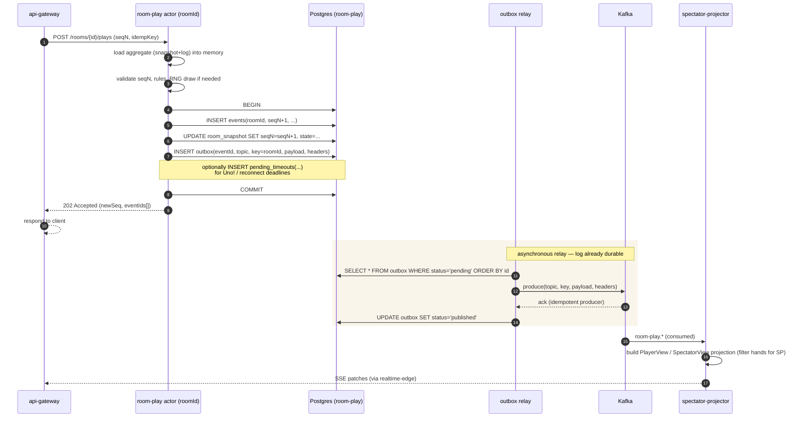
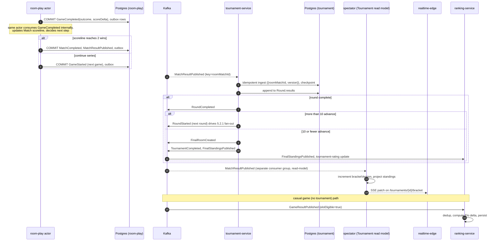
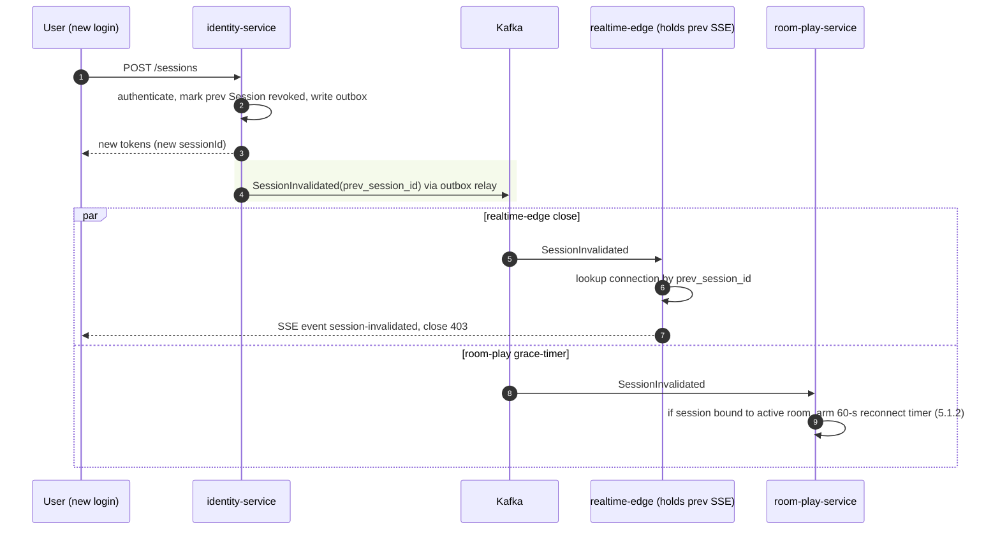

# UnoArena — Architecture Document

## 1. Purpose and Scope

This document defines the technical architecture of the UnoArena platform: the
service decomposition, communication patterns, data architecture, cross-cutting
mechanisms, deployment topology, and architectural decision records that turn
the domain model in `DESIGN.md` into a runnable distributed system.

**In scope.** Logical architecture (services, components, contracts);
communication architecture (synchronous APIs, live delivery, event backbone);
data architecture (per-service stores, read models, retention, audit access);
cross-cutting concerns (identity, security, observability, rate limiting);
deployment architecture (container platform, scaling, partitioning); capacity
sketch; architectural decision records; explicit architectural home for every
domain invariant called out in §2 of the assignment.

**Out of scope.** Concrete deployment manifests, Helm charts, or Terraform
modules; wire-level protocol negotiation (TLS suite, HTTP/2 vs HTTP/3); exact
cloud-vendor SKUs; production-grade SLO numbers (placeholders are given so the
reader can see the intent).

---

## 2. Architectural Drivers

| ID | Driver | Source | Architectural implication                                                                                                                                                        |
|---|---|---|----------------------------------------------------------------------------------------------------------------------------------------------------------------------------------|
| AD-1 | Single authoritative version of game state at all times | NFR-C1, DR-3 | Per-room single-writer model. Every command for a room is routed to its current owner.                                                                                           |
| AD-2 | Concurrent or stale actions must not corrupt state | NFR-C2, NFR-C3, FR-R12, DR-9 | Optimistic concurrency at the service boundary using the per-room monotonic sequence number.                                                                                     |
| AD-3 | Massive simultaneous tournament-match completion (≥100,000 rooms) | NFR-C4, NFR-P3, NFR-SC3, FR-T11 | Asynchronous, partitioned event backbone; tournament advancement is an idempotent multi-step process consuming integration events at-least-once.                                 |
| AD-4 | First-round surge: ~100k rooms transitioning to in-progress within seconds | NFR-P5 | Sharded fan-out workers with rate-limited enqueue and idempotent room creation; thundering-herd controls in front of brokers and gameplay services.                              |
| AD-5 | Live, low-latency state visibility for players and spectators | NFR-P1, NFR-P4, FR-S2 | Dedicated Spectator service building read-only projections from the event backbone; SSE as live delivery channel.                                                                |
| AD-6 | Independent scaling of gameplay, tournaments, ranking, live view, audit | NFR-SC2 | One service per bounded context, each with its own data store and scaling profile.                                                                                               |
| AD-7 | Authoritative auditability and replayability of every game | FR-A1–FR-A4, DR-7 (log-before-broadcast), DR-16 | Event-sourced gameplay command path; events appended to the immutable log inside the same transaction as the outbox row, before any broadcast or projection.                     |
| AD-8 | Single-active-session per player; defence against takeover | FR-I2, NFR-SE7, DR-15 | Centralised Identity service with explicit `SessionInvalidated` event consumed by the realtime edge so superseded SSE streams are forcibly closed (not only token rows updated). |
| AD-9 | High availability; failures in one capability must not invalidate already-accepted results | NFR-R1, NFR-R2 | Loose coupling via async events; immutable integration events; no synchronous cross-service call on the gameplay hot path.                                                       |
| AD-10 | Multi-layer rate limiting and adaptive throttling | NFR-SE5 | Per-IP at the edge gateway, per-user at the identity-aware layer, per-room/per-action at the owning service.                                                                     |
| AD-11 | Server-authoritative RNG and game logs | NFR-SE2, FR-R28, DR-16 | RNG seeds generated server-side in room-play-service, persisted with the originating event, never sent to clients.                                                               |

These drivers are revisited in §17 where each NFR is mapped to the mechanism
that satisfies it.

---

## 3. Architectural Style and Principles

### 3.1 Style

UnoArena is a **microservices, event-driven** platform with **CQRS read models**
on the high-fan-out side. The high-level shape:

- **Bounded-context-per-service.** Each context defined in `DESIGN.md` §2.2
  becomes a deployable service. Services own their data and expose contracts
  (REST, SSE, async events) — never a shared database.
- **Event sourcing in the gameplay hot path.** The Room Play service stores
  every accepted state transition as an event. Aggregate state is rebuilt from
  the event log on demand (recovery, projection, replay).
- **Outbox-pattern publication.** Internal aggregate events are persisted
  atomically with state, then published to the event bus by an outbox relay,
  guaranteeing log-before-broadcast (DR-7) without distributed transactions.
- **Read models / CQRS** for read-heavy projections (Spectator, Ranking
  leaderboards, Tournament analytics).
- **Synchronous APIs only for commands and authoritative single-aggregate
  reads.** Cross-context interactions are asynchronous.

### 3.2 Principles

1. Authority belongs to the aggregate. Validation, sequencing, and acceptance
   are the responsibility of the owning service.
2. At-least-once delivery; idempotency at every consumer.
3. Single writer per partition key (`roomId`, `tournamentId`, `playerId`).
4. Privacy at construction, not delivery (spectator projections never carry
   hand contents).
5. Schema-first contracts; backwards-incompatible changes require a parallel
   new version.
6. No client-side authority for randomness, scoring, or validation.

---

## 4. Service Decomposition

### 4.1 Domain services (one per bounded context)

| Service | Bounded context | Domain classification | Owned aggregates |
|---|---|---|---|
| **room-play-service** | Room Play | Core | `Room`, `Match` (best-of-three series), `GameInstance`, `Player` (room membership) |
| **tournament-service** | Tournament | Core | `Tournament`, `Round`, `RoomMatch` (tournament-side reference) |
| **ranking-service** | Ranking | Supporting | `PlayerRanking` (casual Elo + tournament-placement rating) |
| **spectator-service** | Spectator and Live View | Supporting | `RoomProjection`, `TournamentProjection` (read models only) |
| **audit-service** | Audit and Game History | Supporting | `GameLog`, `SystemAuditLog` |
| **identity-service** | Identity and Session | Generic | `UserAccount`, `Session`, `RoleAssignment` |

### 4.2 Infrastructure / supporting services

| Service | Responsibility |
|---|---|
| **api-gateway** | Public ingress, TLS termination, edge per-IP rate limit, JWT validation, correlation-id injection, REST routing by `roomId` consistent hash. Terminates SSE streams to clients (see §6.1). |
| **realtime-edge** | Logical role of the api-gateway pods that hold long-lived SSE connections. Consumes `SessionInvalidated` from Kafka and closes affected streams. |
| **event-bus** | Apache Kafka cluster carrying integration events. Partitioned by `roomId` / `tournamentId` / `playerId`. |
| **schema-registry** | Versioned Avro/Protobuf schemas for every integration event and external API contract. |
| **object-store** | S3-compatible blob storage for cold audit-log tier and long-term game-log retention (FR-A6). |
| **observability stack** | OpenTelemetry collector, Prometheus, Loki, Tempo/Jaeger. |
| **secrets / KMS** | External KMS for encryption-at-rest and signing keys. |

### 4.3 Service / context map

C4-style container view. Solid arrows are synchronous (REST/mTLS or SSE);
dashed arrows are asynchronous (Kafka via outbox relay, or schema fetch).
Stores are owned exclusively by the service they sit next to — no shared
database.

```mermaid
flowchart TB
    %% ===== Clients =====
    Player([Player Client])
    Spectator([Spectator Client])

    %% ===== Edge =====
    subgraph EDGE["Edge / public trust boundary"]
        direction TB
        GW["api-gateway<br/>• TLS termination<br/>• JWT validation, cached JWKS<br/>• Per-IP and per-user rate limit<br/>• Consistent-hash routing by roomId<br/>• Correlation-id injection"]
        RT["realtime-edge<br/>• Long-lived SSE termination<br/>• Per-room ordering on the stream<br/>• SessionInvalidated → close socket"]
    end

    %% ===== Core domain =====
    subgraph CORE["Core domain services"]
        direction TB
        RP["room-play-service<br/>(Room Play, Core)<br/>• Room / Match / GameInstance<br/>• Single-writer per roomId<br/>• Actor mailbox + event sourcing<br/>• Outbox = log-before-broadcast<br/>• Timer worker (5s Uno!, 60s reconnect)"]
        TR["tournament-service<br/>(Tournament, Core)<br/>• Tournament / Round / RoomMatch<br/>• Idempotent process manager<br/>• Single-writer per tournamentId"]
        TKW["round-kickoff-workers<br/>• Sharded fan-out pool<br/>• Cluster-cooperative rate limiter<br/>• Idempotent room creation"]
    end

    %% ===== Supporting =====
    subgraph SUP["Supporting services"]
        direction TB
        SP["spectator-projector<br/>(Spectator, Supporting)<br/>• PlayerView / SpectatorView<br/>• Privacy at construction<br/>(hands stripped before write)"]
        RK["ranking-service<br/>(Ranking, Supporting)<br/>• Casual Elo (eloEligible filter)<br/>• Tournament-placement rating"]
        AU["audit-service<br/>(Audit, Supporting)<br/>• Immutable GameLog<br/>• SystemAuditLog<br/>• Replay endpoint, RBAC + mTLS"]
    end

    %% ===== Generic =====
    subgraph GEN["Generic"]
        ID["identity-service<br/>(Identity, Generic)<br/>• Sessions, JWT, JWKS<br/>• Single-active-session<br/>• Emits SessionInvalidated"]
    end

    %% ===== Backbone =====
    subgraph BUS["Event backbone"]
        direction TB
        K[("Apache Kafka<br/>partitions:<br/>roomId / tournamentId /<br/>playerId / userId")]
        SR["Schema Registry<br/>Avro/Protobuf, versioned"]
    end

    %% ===== Stores =====
    subgraph STORES["Per-service stores (owned, never shared)"]
        direction LR
        RPDB[("Postgres<br/>events + snapshot +<br/>outbox + pending_timeouts")]
        RPRD[("Redis<br/>next-deadline set,<br/>presence")]
        TRDB[("Postgres<br/>tournaments +<br/>processed_match_results")]
        RKDB[("Postgres<br/>player_ranking,<br/>rating_history")]
        RKRD[("Redis<br/>leaderboard cache")]
        SPDB[("Postgres<br/>projection state +<br/>per-room patch log")]
        SPRD[("Redis<br/>snapshot cache")]
        AUDB[("Postgres<br/>hot audit tier")]
        OBJ[("S3-compatible<br/>cold audit tier")]
        IDDB[("Postgres<br/>users / sessions / roles")]
        KMS{{"KMS<br/>signing keys"}}
    end

    %% ===== Sync client flows =====
    Player -- "REST commands (JWT, Idempotency-Key, X-Sequence-Number)" --> GW
    Player -- "GET PlayerView (SSE)" --> RT
    Spectator -- "GET SpectatorView (SSE)" --> RT

    %% ===== Sync gateway → services (mTLS in mesh) =====
    GW -- "POST /rooms/* (consistent hash by roomId)" --> RP
    GW -- "POST /tournaments/*" --> TR
    GW -- "GET /players/*, /leaderboards/*" --> RK
    GW -- "GET /games/{id}/log-entries, /system-audit-entries" --> AU
    GW -- "POST /sessions, /users; /.well-known/jwks.json" --> ID
    GW -. "JWKS (cached)" .-> ID

    %% ===== Outbox → broker =====
    RP -. "outbox relay" .-> K
    TR -. "outbox relay" .-> K
    ID -. "outbox relay" .-> K

    %% ===== Broker → consumers =====
    K -. "RoundStarted, FinalRoomCreated, SessionInvalidated" .-> RP
    K -. "MatchResultPublished" .-> TR
    K -. "RoomCreationRequested (internal topic)" .-> TKW
    K -. "GameResultPublished, FinalStandingsPublished" .-> RK
    K -. "room-play.* and tournament.* events" .-> SP
    K -. "all events (superset)" .-> AU
    K -. "SessionInvalidated (one consumer per pod)" .-> RT

    %% ===== Round-kickoff fan-out =====
    TKW -- "POST /rooms (idempotent, rate-limited)" --> RP

    %% ===== Projection → SSE =====
    SP -- "patches (sequenceNumber-ordered)" --> RT

    %% ===== Schema registry =====
    SR -. "schemas (fail-closed at startup)" .-> RP
    SR -. " " .-> TR
    SR -. " " .-> RK
    SR -. " " .-> SP
    SR -. " " .-> AU
    SR -. " " .-> ID

    %% ===== Stores ownership =====
    RP --- RPDB
    RP --- RPRD
    TR --- TRDB
    RK --- RKDB
    RK --- RKRD
    SP --- SPDB
    SP --- SPRD
    AU --- AUDB
    AU --- OBJ
    ID --- IDDB
    ID --- KMS

    %% ===== Styling =====
    classDef client fill:#fff4d6,stroke:#c08a00,color:#000
    classDef edge fill:#dde8ff,stroke:#3355aa,color:#000
    classDef core fill:#ffe2d6,stroke:#cc4a1a,color:#000
    classDef sup fill:#dff5db,stroke:#3a8c2a,color:#000
    classDef gen fill:#eeeeee,stroke:#666,color:#000
    classDef store fill:#f4f4f4,stroke:#888,color:#000
    classDef bus fill:#ffffff,stroke:#000,stroke-width:2px,color:#000
    class Player,Spectator client
    class GW,RT edge
    class RP,TR,TKW core
    class SP,RK,AU sup
    class ID gen
    class RPDB,RPRD,TRDB,RKDB,RKRD,SPDB,SPRD,AUDB,OBJ,IDDB,KMS store
    class K,SR bus
```



**Reading the diagram.**

- **Trust boundaries.** Public clients hit only `api-gateway` and
  `realtime-edge`. Inside the cluster, every service-to-service call uses
  mTLS via the service mesh. Stores sit inside each service's bubble — the
  diagram has no arrow from one service into another service's database.
- **Sync vs async (visual cue).** Solid arrows = synchronous request/
  response (REST or SSE) with timeouts and retry on `Idempotency-Key`.
  Dashed arrows = asynchronous Kafka traffic emitted via the **outbox
  relay** (so each producer's events are durably committed before they
  cross the dashed line — this is how DR-7 / log-before-broadcast is
  realised at the topology level).
- **No synchronous arrows between domain services.** The only
  cross-service synchronous calls are: (a) downstream services fetching
  `identity-service` JWKS (cached, dashed JWKS line), and (b) the
  optional `tournament-service → ranking-service` seeding query
  described in `DESIGN.md` §2.3 (omitted from the diagram for clarity;
  wrapped by an anti-corruption translator inside `tournament-service`).
- **Round-kickoff path** is the one cross-context fan-out where a
  partitioned topic (`tournament.room-creation`) feeds a worker pool
  that calls `room-play-service` over REST with idempotency keys — it
  is drawn explicitly because it is the dominant scale event (§5.2.1,
  AD-4 / NFR-P5).
- **Session-invalidation push.** `identity-service → Kafka →
  realtime-edge` (every pod consumes) is what closes superseded SSE
  sockets; `room-play-service` consumes the same topic to arm the
  60-s grace timer (§5.6.1).

---

## 5. Bounded Context Architectures

Each subsection below follows the same template — **Purpose and scope ·
Services · Public interfaces · Internal-only interfaces · Dependencies on
other contexts** — plus the context-specific architectural homes for the
domain invariants consolidated in §8 (sequence number, log-before-broadcast,
timer durability, single-active-session, spectator privacy, match-series
coordination, abandoned-vs-completed outcomes).

### 5.1 Room Play (Core)

**Purpose and scope.** Owns the lifecycle of a room from creation through the
last game of a best-of-three match: command validation, sequence-number
assignment, deck/RNG, hand state, turn timer, Uno! challenge window,
disconnection grace timer, match-series scoreline, and emission of
`GameResultPublished` and `MatchResultPublished` integration events. Does **not**
own bracket logic, leaderboards, or audit retention.

**Services.**

- **room-play-service** — single deployable. Stateful per-room actor (§11.1);
  embeds the Match-series state machine; embeds the RNG (`presentation` does
  not require a separate RNG context, so it is colocated for tight log-ordering
  guarantees).

**Synchronous public interface (REST/JSON, JWT).**

Every state-changing request carries `Idempotency-Key`, `X-Sequence-Number`,
and `X-Correlation-Id` headers (see §6.5). Resources are nouns; commands are
sub-resource creations.

| Verb | Path | Command | Notes |
|---|---|---|---|
| POST | `/rooms` | `CreateRoom` | Returns new `roomId` in `Location`. |
| GET  | `/rooms/{roomId}` | — | Authoritative room snapshot. |
| POST | `/rooms/{roomId}/players` | `JoinRoom` | Capacity 2–10. |
| POST | `/rooms/{roomId}/matches` | `StartMatch` | Host-only; opens the best-of-three series. |
| POST | `/rooms/{roomId}/plays` | `PlayCard` | Sequence-checked. |
| POST | `/rooms/{roomId}/draws` | `DrawCard` | Sequence-checked. |
| POST | `/rooms/{roomId}/wild-color-choices` | `ChooseWildColor` | After a wild play. |
| POST | `/rooms/{roomId}/uno-calls` | `CallUno` | Within challenge-window rules. |
| POST | `/rooms/{roomId}/uno-challenges` | `ChallengeUnoCall` | Must arrive within 5s window. |
| PUT  | `/rooms/{roomId}/players/{playerId}/connection` | `ReconnectToRoom` | Within 60s grace. |

Responses: `202 Accepted` with `{ sequenceNumber, eventIds[] }` on success;
`409 Conflict { currentSequenceNumber }` on stale sequence (client reconciles
from SSE); `403` for actor/role violations; `429` from the rate limiter.
**Versioning** is by URI prefix (`/v1/...`) plus `Accept` content-type
negotiation for major schema bumps.

**Asynchronous public interface (events to Kafka).**

| Event | Producer | Key | Payload owner | Notes |
|---|---|---|---|---|
| `GameStarted` | room-play | `roomId` | room-play | Carries RNG seed. Internal + audit. |
| `CardPlayed`, `CardDrawn`, `WildColorChosen`, `UnoCalled`, `UnoChallenged`, `DrawPileReshuffled`, `TurnSkipped` | room-play | `roomId` | room-play | Internal events; spectator-service and audit-service subscribe. |
| `ChallengeWindowExpired` | room-play (timer worker) | `roomId` | room-play | Idempotent; deduped by `{gameId, challengeId}`. |
| `ReconnectionTimerExpired` | room-play (timer worker) | `roomId` | room-play | Idempotent; deduped by `{roomId, sessionId, openedAt}`. |
| `GameCompleted` | room-play | `roomId` | room-play | Discriminator: `outcome ∈ {completed, abandoned}`. Used by Match-series state machine and downstream consumers. |
| `GameResultPublished` | room-play | `playerId` (one event per player ranking) **or** `roomId` (one fan-out event) — the architecture publishes **one** event per game keyed by `roomId` and ranking-service repartitions on `playerId` via its consumer | room-play | Carries `outcome ∈ {completed, abandoned}`, players, scores. Downstream Elo path. |
| `MatchCompleted` | room-play | `roomId` | room-play | Series finished (early termination at 2 wins, or after game 3). Carries scoreline and series winner. Internal event; drives `MatchResultPublished` outbox emission. |
| `MatchResultPublished` | room-play | `roomMatchId` | room-play | Cross-context contract for tournament-service ingestion. |

**Idempotency keys.** Commands deduped by `Idempotency-Key` over a configurable
window. Internal events carry a UUID `eventId` plus `{roomId, sequenceNumber}`
which downstream consumers use as their dedup key.

**Internal-only interfaces.** A control-plane endpoint
`POST /rooms/{roomId}/recover` invoked by the partition coordinator after a
rebalance forces a snapshot+log rehydrate (not exposed through the public
gateway). Intra-pod actor mailboxes are not network-addressable.

**Dependencies on other contexts.**

- *Upstream (consumes):* `RoundStarted`, `FinalRoomCreated` from
  tournament-service (drives room creation for tournament rounds);
  `SessionInvalidated` from identity-service (drives session eviction and the
  60-s grace-timer flow). Tournament events are consumed through an
  anti-corruption translator that maps `RoundStarted.bracketSeats` →
  internal `CreateRoomFromTournamentSeat` commands.
- *Downstream (publishes for):* tournament-service, ranking-service,
  spectator-service, audit-service.
- Relationship: room-play is the **published-language** producer; downstream
  contexts are conformist on the canonical event schema, except the
  tournament read-model side which keeps its own translator.

#### 5.1.1 Log-before-broadcast (architectural home for DR-7)

Every accepted command in room-play-service runs the following sequence inside
**one Postgres transaction**:

1. Validate sequence number and command rules against the in-memory aggregate.
2. Append the new event row(s) to `events(room_id, sequence_number, type,
   payload_json, server_ts)` (the immutable game log).
3. Update the `room_snapshot` row.
4. Insert one row per outgoing message into the `outbox(event_id, topic, key,
   payload, headers, status)` table.
5. Commit.

Only after commit does the actor return `202` to the caller. A separate
**outbox relay** (single-writer per partition, leader-elected via Postgres
advisory lock) reads `outbox` rows in `event_id` order and publishes to Kafka
with idempotent producer semantics, marking rows `published`. Spectator
projections, audit ingestion, and ranking eligibility all derive from the
Kafka stream — none of them sees an event before the log row is durable.

A pod crash between step 5 and Kafka publication is recovered by the relay on
restart: the `outbox` row is the source of truth, Kafka is downstream. A
crash before step 5 means the command never happened — the client retries
with the same `Idempotency-Key` and either gets the prior result (if the
transaction did commit and the response was lost) or re-runs validation.

The intra-context sequence for this is mandatory and appears in §15.1.

#### 5.1.2 Domain timer durability (5-s Uno!, 60-s reconnection)

Both timers are owned by **room-play-service** and have an explicit deadline
persisted in Postgres alongside the aggregate state — Redis is a cache of
**which timers fire next**, not the source of truth.

**Persistence model.** A `pending_timeouts(timer_id, room_id, kind, deadline,
dedup_key, status)` table stores every armed deadline:

- `kind = 'uno_challenge_window'`, `dedup_key = {gameId, challengeId}`.
- `kind = 'reconnection_grace'`, `dedup_key = {roomId, sessionId, openedAt}`.

Insertion of the row happens in the **same transaction** as the event that
opens the window (`UnoCalled` or `PlayerDisconnected`). Redis holds a sorted
set keyed on `deadline` so the timer worker fires without table scans; it is
rebuilt from Postgres on restart.

**Owner of expiry.** A small **timer worker** runs as part of the
room-play-service deployment. The pod that currently owns the room partition
(§11.1) is also the only pod that may fire that partition's timeouts — leader
election piggy-backs on the partition coordinator. On firing, the worker:

1. Conditionally updates `pending_timeouts.status` from `armed` to `firing`
   (single-row CAS — guarantees at-most-one firer even under failover).
2. Routes the synthetic command (`ExpireChallenge`, `ExpireReconnection`)
   through the same actor mailbox as a normal command; the actor validates
   the dedup key against already-applied effects and either applies or
   no-ops.
3. Persists the resulting event(s) and outbox rows in the standard
   transaction.

**Crash / failover behaviour.** If the owning pod dies mid-window the
deadline is preserved in Postgres. The new owner rehydrates the in-memory
sorted set from `pending_timeouts WHERE status='armed' AND deadline >= now() -
clock_skew` and fires immediately for any deadline already in the past;
`status='firing'` rows are recovered (rolled back to `armed`) before the
sorted set rebuild. Wall-clock skew between pods is bounded by NTP and a
configurable `clock_skew_grace`.

**Idempotency of expiry side effects.** The dedup key is unique per timer
instance. Repeated firing of the same `dedup_key` is rejected at the
aggregate (the actor records `applied_dedup_keys` per game, persisted with
the game state), so a double-fire under partition rebalance cannot apply
penalties twice.

This pattern owns both windows uniformly; it is reflected as a saga-style
row in the integration table (§6.4).

#### 5.1.3 Match-series coordination (best-of-three)

The cross-game state machine lives **inside room-play-service** as a `Match`
aggregate distinct from `GameInstance`. Its persisted state:

```
Match { matchId, roomId, players[], scoreline[playerId → wins], status,
        currentGameId, gamesPlayed }
```

Lifecycle:

- `StartMatch` creates the `Match` and immediately starts game 1 by emitting
  `GameStarted` (same transaction).
- Each `GameCompleted` is consumed by the **Match aggregate inside the same
  pod** (no Kafka round-trip — same partition, same actor mailbox, same
  Postgres transaction): the scoreline is updated, and:
  - if `outcome = abandoned` (all players forfeited), the match is closed
    without a winner and `MatchCompleted(outcome=abandoned)` is emitted;
  - if some player has 2 wins, `MatchCompleted(outcome=completed,
    winnerId)` and `MatchResultPublished` are emitted;
  - otherwise a new `GameInstance` is created and `GameStarted` is emitted.

The transaction is the same outbox transaction described in §5.1.1, so
log-before-broadcast holds across the game-to-game transition. There is no
gap during which the broker has been told game N completed but room-play has
not yet started game N+1.

A separate, more contentious model (treating each game as an independent
isolated room and stitching via Kafka) was explicitly rejected: it loses the
log-before-broadcast atomicity across the series boundary and would require
saga compensation for tie-breaker corner cases.

#### 5.1.4 Abandoned-game-vs-completed-game outcome detection

Detection is owned by room-play-service:

- **Abandonment** is detected when (a) every player except possibly one has
  exhausted their reconnection grace timer, (b) all remaining players have
  forfeited explicitly, or (c) tournament timeout (`AbandonRoomDeadline`,
  emitted by tournament-service for stale tournament rooms) is consumed.
- **Completion** is the normal "first to empty hand wins the game".

The distinction is carried explicitly in the events:

- `GameCompleted.outcome ∈ {completed, abandoned}`.
- `GameResultPublished.outcome ∈ {completed, abandoned}` — ranking-service
  skips Elo updates when `outcome = abandoned`. Tournament games never reach
  ranking-service via this event — `GameResultPublished` is produced only for
  casual rooms, so tournament exclusion is enforced at the source.
- `MatchResultPublished.outcome ∈ {completed, abandoned, forfeit_all}` —
  consumed by tournament-service to record forfeits as advancement losses
  per `DESIGN.md` §1.2.

Ranking-service therefore does not need to introspect domain rules beyond
checking `outcome`; the Elo-scope rules (FR-K1, FR-K2, FR-K5, DR-6 — no
tournament games, no abandoned casual games) are enforced at the producer.

### 5.2 Tournament (Core)

**Purpose and scope.** Owns the tournament lifecycle: registration window,
bracket generation, round transitions, room/seat assignment, top-3
advancement with tie-breakers (`DESIGN.md` §1.2), final-room creation, and
final-standings publication. Does **not** own gameplay or per-room results
beyond ingesting `MatchResultPublished`.

**Services.**

- **tournament-service** — the orchestrator and authoritative aggregate
  store.
- **round-kickoff-workers** — a horizontally-scalable worker pool deployed
  as a separate Deployment within the tournament-service Helm release;
  consumes the `tournament.round-kickoff-queue` and creates rooms in
  parallel. See §5.2.1.

**Synchronous public interface.**

| Verb | Path | Command / Purpose |
|---|---|---|
| POST   | `/tournaments` | `CreateTournament` |
| GET    | `/tournaments/{id}` | Bracket state, round status (read model) |
| PUT    | `/tournaments/{id}` | `OpenRegistration` / `CloseRegistration` / `CancelTournament` (state transitions via `{ status }` body) |
| POST   | `/tournaments/{id}/registrations` | `RegisterForTournament` |
| DELETE | `/tournaments/{id}/registrations/{playerId}` | `WithdrawRegistration` (only while window open) |

**Asynchronous public interface.**

| Event | Producer | Key | Payload owner |
|---|---|---|---|
| `RegistrationOpened`, `RegistrationClosed` | tournament | `tournamentId` | tournament |
| `RoundStarted` | tournament | `tournamentId`, fan-out via room-creation messages | tournament |
| `RoomCreationRequested` (internal-to-context queue) | tournament | `roomId` (sharded) | tournament |
| `RoundCompleted` | tournament | `tournamentId` | tournament |
| `FinalRoomCreated` | tournament | `tournamentId` | tournament |
| `TournamentCompleted`, `FinalStandingsPublished` | tournament | `tournamentId` | tournament |
| `TournamentCancelled` | tournament | `tournamentId` | tournament |

**Asynchronous input.** `MatchResultPublished` (key `roomMatchId`) from
room-play-service. Consumer-side idempotency key
`{roomMatchId, matchResultVersion}`.

**Internal-only interfaces.** The `RoomCreationRequested` topic is internal
to the tournament context; only `round-kickoff-workers` consume it.
room-play-service consumes only the externalised `RoundStarted` /
`FinalRoomCreated` envelopes.

**Dependencies.** Upstream from room-play-service (consumes
`MatchResultPublished`); downstream of identity-service for actor JWT
validation. Conformist-on-published-language for room-play events.

#### 5.2.1 First-round surge: round kickoff architecture

The first-round transition is the dominant scale event:
on the order of 100,000 rooms must be created within seconds (AD-4). The
architecture decomposes the work into three stages so no single component is
a choke point.

```
[ tournament-service ]  ──RoundStarting──►  [ round-kickoff-workers (sharded) ]
       │  (commits round transition,                │  (consume in parallel,
       │   writes RoomCreationRequested rows           call room-play-service
       │   to outbox, one per seat group)              POST /rooms idempotently)
       ▼                                              ▼
   Postgres outbox  ──relay──►  Kafka  ──►  room-play-service (sharded)
```

**Stage 1 — Transition.** A single-writer process manager inside
tournament-service flips `Round.status` from `pending` to `kicking_off`
inside one transaction, and writes one `RoomCreationRequested` outbox row
per seat group of N seats (N is configurable; default 8 — i.e. one room per
row). The transition is a small atomic write — no fan-out happens here.

**Stage 2 — Sharded fan-out.** The outbox relay publishes
`RoomCreationRequested` to Kafka topic `tournament.room-creation` partitioned
by `hash(tournamentId, seatGroupIndex) % P`. P is sized to absorb the surge
(see §9). The `round-kickoff-workers` Deployment consumes the topic with a
consumer group of W pods; each pod uses a bounded concurrency pool and a
**rate-limited dispatcher** (token bucket) so the aggregate POST rate to
room-play-service is held below a configurable ceiling.

**Stage 3 — Idempotent room creation.** Each worker calls
`POST /rooms` with `Idempotency-Key = {tournamentId, roundIndex, seatGroupIndex}`.
A retry of an already-created seat group returns the same `roomId` from the
idempotency cache. On 5xx the worker re-enqueues with exponential backoff;
poison messages flow to a per-topic DLQ after N attempts and surface on the
operator dashboard.

**Thundering-herd controls.**

- Sharded workers (W ≈ 200 at peak) instead of one fan-out task.
- Token-bucket per-worker, plus a global cooperative limiter using a Redis
  cell (`CL.THROTTLE`) to bound the cluster-wide POST rate.
- Pre-warming: tournament-service emits a `RoundPreflight` event ~30 s
  before kickoff so room-play-service can scale its Deployment ahead of the
  burst (HPA target latency).
- Backpressure: if Kafka producer publish latency on `tournament.room-creation`
  exceeds threshold, the kickoff process manager pauses outbox emission
  until the lag clears — converting a possible cascade into an observable
  (and bounded) round-start delay rather than a service brownout.

**Partial failure and compensation.** If after T seconds some seat groups
remain uncreated, tournament-service either compensates (forfeits the
unjoined seats, with `MatchResultPublished(outcome=forfeit_all)` synthesised)
or, if more than X% are missing, transitions the round to `kickoff_failed`
and surfaces an operator alert. Compensation is itself idempotent.

#### 5.2.2 Round-end ingestion / read-model spike

At round end, ~100k `MatchResultPublished` events arrive within seconds. The
write-side and the read-side are deliberately separated:

- **Write-side (tournament-service core).** Consumes `MatchResultPublished`
  on a partitioned consumer group keyed by `tournamentId`. Each partition
  is a single-writer process manager; ingestion of a single partition's
  worth of events is parallelised inside that writer with idempotent steps
  (`processed_match_results` table). Top-3 computation runs per
  `RoomMatch`, results are appended to `Round.results[]`, and the round
  closes only after all expected results land (or the round timeout fires
  and forfeits the missing seats — see above). This is checkpointed at
  every step.
- **Read-side (Tournament read model in spectator-service).** Bracket and
  standings projections are built by spectator-service from the same Kafka
  stream on a separate consumer group with its own partitioning and dedup
  table. The read-model pipeline never feeds back into the write-side, so
  read-side congestion cannot push backpressure into room-play-service or
  the write-side process manager.
- **Coherence guarantees.** Bracket views are versioned: each projection
  update carries the `roundIndex` and a monotonic `bracketVersion`; clients
  can reason about staleness ("you are looking at v17 of round 4"). Bounded
  staleness target: 5 s P95 from `MatchResultPublished` to projected
  bracket update under burst conditions.

The producer→consumer path is row TRN-RM in the integration table (§6.4).

### 5.3 Ranking (Supporting)

**Purpose and scope.** Casual Elo and tournament-placement rating per
player, plus leaderboards. Does **not** decide eligibility of an event —
that decision is carried by the producing event (`eloEligible`, presence of
`tournamentId`).

**Services.** `ranking-service`.

**Synchronous public interface (REST + SSE; content-negotiated).**

| Verb | Path | Purpose |
|---|---|---|
| GET | `/players/{playerId}/ranking` | Current ratings (casual + tournament). |
| GET | `/players/{playerId}/rating-history` | Paginated history (`?type=casual\|tournament&page=...`). |
| GET | `/leaderboards/casual` | Casual Elo leaderboard. JSON snapshot or `text/event-stream` for live. |
| GET | `/leaderboards/tournament` | Tournament-placement leaderboard. |

**Asynchronous input.**

| Event | Key in Ranking | Idempotency key |
|---|---|---|
| `GameResultPublished` | `playerId` (consumer rekeys) | `{gameId, sequenceNumber, playerId}` |
| `FinalStandingsPublished` | `tournamentId` | `{tournamentId, finalStandingsVersion, playerId}` |

Eligibility filtering: skip if `outcome = abandoned`; `GameResultPublished`
is produced only for casual games so tournament exclusion is enforced at
the source. The tournament path consumes only `FinalStandingsPublished`,
so tournament rooms never reach the casual Elo path.

**Internal-only interfaces.** Materialised-view refresh worker (Postgres
`REFRESH MATERIALIZED VIEW CONCURRENTLY`) triggered post-consumption. It runs
on the named consumer group `ranking-leaderboard-materializer` (distinct from
the `spectator-projector` and `tournament-readmodel` groups), so leaderboard
refresh lag is tracked and scaled independently of the Elo write path. Refresh
cadence and the resulting staleness bound are stated in §7.1 / §13.2.

**Dependencies.** Conformist consumer of room-play and tournament events.

### 5.4 Spectator and Live View (Supporting)

**Purpose and scope.** Read-only projections of room and tournament state,
delivered live to clients. Hand contents and RNG seeds are **never** part of
spectator projections. Does **not** own authoritative state.

**Services.**

- **spectator-projector** — consumes Kafka events, builds projections in
  Postgres (read model) and an append-only patch log per room.
- **realtime-edge / sse-fanout** — stateless tier holding long-lived SSE
  connections, pulling patches from the projector and pushing to clients;
  this tier also consumes `SessionInvalidated` for session push-invalidation
  (§5.6.1).

This split lets the SSE-fan-out tier scale on connection count while the
projector tier scales on event throughput.

**Public live API (SSE).**

| Verb | Path | Purpose | Notes |
|---|---|---|---|
| GET | `/rooms/{roomId}/player-view` | Caller's `PlayerView` (own hand + public state) | JWT must bind to a `playerId` enrolled in the room. |
| GET | `/rooms/{roomId}/spectator-view` | Public `SpectatorView` (no hands, no RNG seeds) | Role-checked. |
| GET | `/tournaments/{tournamentId}/bracket` | Bracket and standings projection | JSON snapshot or SSE. |

Each SSE response carries an initial `snapshot` event followed by
sequence-numbered `patch` events; reconnection uses `Last-Event-ID`
(`DESIGN.md` §6.4).

**Privacy enforcement (architectural home for the FR-S6 / DR-5 spectator-projection
invariant).** `SpectatorView` is built from a **filtered subset of events**
selected at projection construction time: hand-changing internal events
(`CardDealt`, `CardPlayed`-with-hand-state-delta) are projected onto
`SpectatorView` with hand contents stripped before the patch is written to
the projection store. Authorization at the SSE endpoint chooses *which*
projection to subscribe to (player vs. spectator). Even a flawed
authorization would only expose another spectator view — the data is not
present in the spectator-projection store at all (privacy at construction,
not delivery). This is the projection model: **CQRS with event-carried state
transfer for public events and projection-time filtering for private
events**; snapshots+deltas are persisted in the projection store and
replayed via SSE.

**Asynchronous input.** All public room-play internal events plus
integration events from tournament-service and ranking-service. Plus
`SessionInvalidated` from identity-service (consumed only by realtime-edge —
see §5.6.1).

**Owned data.** Postgres `spectator`: per-room `PlayerView` and
`SpectatorView` projection state, append-only patch log per room. Redis:
short-lived snapshot cache for high-fan-out spectator views to absorb
thundering herds on popular rooms.

**Dependencies.** Conformist on room-play, tournament, ranking, identity.

### 5.5 Audit and Game History (Supporting)

**Purpose and scope.** Owns the immutable `GameLog` and `SystemAuditLog`,
their retention, and the read path for dispute resolution and operational
audit. Does **not** own live state.

**Services.** `audit-service`.

**Public read API (the read path for the immutable game log — explicit
treatment for FR-A5 dispute resolution and FR-A7 sensitive-operation audit).**

| Verb | Path | Purpose | Authorization |
|---|---|---|---|
| GET | `/games/{gameId}/log-entries` | Full ordered event log of a game | Roles: `dispute_operator`, `compliance`, `tournament_operator` (own tournament). Step-up auth required. |
| GET | `/games/{gameId}` | Deterministic replay (`Accept: application/x-replay-stream`) or metadata (`Accept: application/json`) | Same as above. |
| GET | `/system-audit-entries` | Sensitive-operation audit query (filter by `actorId`, `targetId`, `type`, time window) | `compliance`, `admin`. |
| POST | `/exports` | Asynchronously export a game or window of audit entries to the operator's S3-compatible bucket | `compliance` only; uses pre-signed URLs returned by the export worker. |

**Authorization model.** All audit reads enforce: (a) JWT validation at the
gateway, (b) mTLS between gateway and audit-service, (c) role check at the
service boundary, (d) per-resource scope check (e.g., `tournament_operator`
can only read games belonging to a tournament they operate), and (e) every
read is itself appended to `SystemAuditLog` with `actorId`, `correlationId`,
and the queried resource — audit reads are themselves audited. **Break-glass
access** for incident response is gated by a separate signing key and a 4-eyes
approval recorded in `SystemAuditLog`.

**Automated replay jobs.** Run inside the audit-service deployment; they
authenticate via service-account mTLS and a short-lived signed token issued
by identity-service for the `replay_job` role.

**Asynchronous input.** Every domain integration event — audit-service is
the **superset consumer**. It receives data spectator-service deliberately
does not (hand contents, RNG seeds), because audit's privacy boundary is
operator-scoped, not public-spectator-scoped.

**Owned data.** Postgres `audit` (hot tier, append-only); object store
(S3-compatible) for the cold tier. Both tiers are append-only; cold
migration is a periodic job. Retention policies are per record class
(FR-A6, `DESIGN.md` A9).

**Dependencies.** Conformist on every other service's event schema.

### 5.6 Identity and Session (Generic)

**Purpose and scope.** User registration, authentication, JWT issuance,
session lifecycle, role administration. Enforces single-active-session per
user (DR-15) and emits the events catalogued in `DESIGN.md` §3.6.

**Services.** `identity-service`.

**Synchronous public interface.**

| Verb | Path | Purpose |
|---|---|---|
| POST   | `/users` | Register a new account. |
| POST   | `/sessions` | Create a session (login). On success, triggers `SessionInvalidated` for any prior active session. |
| GET    | `/sessions/current` | Read the caller's session metadata. |
| PUT    | `/sessions/current/tokens` | Rotate access + refresh tokens. |
| DELETE | `/sessions/current` | Logout (explicit invalidation). |
| GET    | `/.well-known/jwks.json` | Public keys for downstream JWT validation; cached aggressively. |
| GET    | `/users/{userId}/roles` | List a user's roles. |
| PUT    | `/users/{userId}/roles/{role}` | Assign role (admin, idempotent). |
| DELETE | `/users/{userId}/roles/{role}` | Revoke role (admin). |

**Asynchronous output.**

| Event | Key | Consumers |
|---|---|---|
| `LoginAttempted` | `userId` | audit |
| `SessionStarted` | `userId` | audit, realtime-edge |
| `SessionInvalidated` | `userId` (and `sessionId` in payload) | **realtime-edge**, room-play, audit |
| `SessionRefreshed` | `userId` | audit |
| `RoleChanged` | `userId` | audit, room-play, tournament |

**Dependencies.** Identity is upstream-of everyone for authentication; no
runtime dependency on any other context. Public-language producer for all
session events.

#### 5.6.1 Single-active-session push-invalidation path (architectural home for DR-15)

FR-I2 and DR-15 require more than a token row flip — a superseded session
must lose its open SSE streams promptly, not only have a database flag set
that the client never reads. The path is:

1. New `POST /sessions` succeeds. Inside one transaction identity-service:
   marks the prior `Session` row revoked, records `SessionInvalidated` in
   the outbox, returns new tokens to the new session.
2. The outbox relay publishes `SessionInvalidated` to Kafka topic
   `identity.session-invalidated`, partitioned by `userId`. Header
   `prev_session_id` carries the superseded session id.
3. **realtime-edge** consumes this topic on a consumer group with one
   member per pod (so every pod sees every event). Each pod looks up its
   in-process connection table for `prev_session_id`; if found, it sends a
   final SSE `event: session-invalidated` frame and closes the stream with
   `403`. Connection lookup is O(1); the connection table is keyed by
   `sessionId` at SSE connect time.
4. **room-play-service** consumes the same topic; if `prev_session_id` is
   bound to an active room, it triggers the 60-s grace-timer flow on
   behalf of the corresponding player.
5. The new session's stream subscribes normally and is bound to the new
   `sessionId`.

This is a **push channel**, not polling: the closing latency is bounded by
Kafka end-to-end latency (~hundreds of ms) plus realtime-edge consumer lag
(~tens of ms). Database flag-flipping alone is insufficient because the
client never reads it; the architecturally meaningful effect is the
explicit close on the open SSE socket.

A row in the integration table (§6.4) — IDN-RT — captures this path.

---

## 6. Communication Patterns

### 6.1 Client connection model (mandatory)

**Pattern.** **REST for commands and authoritative single-aggregate reads;
Server-Sent Events for live state delivery.** No WebSocket, no gRPC streaming
to clients (rationale: ADR-3, §6.1).

**Why this combination.**

- Commands need request/response with rich error semantics (sequence-conflict
  reconciliation, idempotency keys, rate-limit headers): REST is the natural
  fit and aligns with what every HTTP load balancer and CDN already
  understands.
- Live state from server to client is naturally append-only and one-way; SSE
  matches the underlying event-sourced model and brings `Last-Event-ID`
  reconnection for free.
- HTTP-only flow (REST + SSE both ride HTTP/1.1+TLS) maximises compatibility
  with mobile networks, captive portals, corporate proxies, and standard L7
  load balancers — important for a global tournament audience.

**Terminating deployable.** Long-lived SSE connections terminate at
**realtime-edge** (logically the SSE-handling pods of the api-gateway
deployment). Commands terminate at the api-gateway and are forwarded to the
appropriate room-play-service pod via consistent-hash routing.

**Per-room ordering on the stream.** Spectator-projector tags each patch with
the source `roomId` and the room's `sequenceNumber`. realtime-edge writes
patches into the per-connection SSE stream in `sequenceNumber` order;
client-side `Last-Event-ID` resumes from the last delivered sequence.
Because each room is a single-writer (§5.1), there is a total order of
events per `roomId` upstream of the SSE tier.

**Composition with session invalidation.** SSE connection state is keyed by
`sessionId` at the realtime-edge. `SessionInvalidated` consumption (§5.6.1)
closes the matching connection forcibly with a final `event:
session-invalidated`. The client's reconnect attempt fails with `401` until
it presents the new token, which prevents a superseded session from
persisting a live channel.

**Composition with spectator privacy.** A connection's subscription scope is
chosen at connect time based on the JWT's `playerId` and `roomId` membership:
- An enrolled player gets `/rooms/{roomId}/player-view` — its hand is in the
  projection.
- Anyone else gets `/rooms/{roomId}/spectator-view` — hands are not in the
  projection at all (§5.4). Subscription scope cannot be widened mid-stream.

### 6.2 Synchronous: REST commands and authoritative reads

- **Transport.** HTTP/1.1+TLS at the edge; HTTP/2 internally for header
  compression. JSON payloads.
- **Authentication.** JWT bearer issued by identity-service. Validated at the
  gateway against cached JWKS; the gateway forwards verified `X-User-Id`,
  `X-Session-Id`, and `X-Roles` headers so downstream services do not
  re-verify. Service-to-service calls inside the cluster use mTLS via the
  service mesh.
- **Idempotency.** Every state-changing request carries `Idempotency-Key`
  (per-session nonce; receiving service stores result for a configurable
  retention) and `X-Sequence-Number` (mismatch returns `409 Conflict` with
  current value).
- **Correlation.** `X-Correlation-Id` is generated by the gateway if
  absent and propagated through every event and log entry.

### 6.3 Asynchronous: event bus

- **Broker.** Apache Kafka.
- **Topic strategy.** One topic per integration event type (e.g.
  `room-play.GameResultPublished`, `room-play.MatchResultPublished`,
  `tournament.RoundStarted`, `identity.SessionInvalidated`,
  `tournament.room-creation`). Audit consumes a multi-topic feed.
- **Partition keys.** room-play events by `roomId`, tournament by
  `tournamentId`, ranking by `playerId`, identity by `userId`.
- **Delivery semantics.** At-least-once. Producers use idempotent Kafka
  producers; consumers commit offsets only after the application-level
  idempotency check has succeeded.
- **Outbox.** Producing services persist the event to an `outbox` table in
  the same transaction as the aggregate state. A relay publishes from the
  outbox to Kafka. Guarantees log-before-broadcast (DR-7, FR-A1, §5.1.1).
- **Dead-letter handling.** Per-topic DLQ with the original payload and
  failure reason; alerts the on-call.

### 6.4 Integration table

Every significant integration is documented as a row. Pattern legend:
**Sync** (REST), **Pub/Sub** (Kafka topic), **Saga** (multi-step
process-manager), **JWT** (token validation only).

| # | From → To | Pattern | Rationale | Failure semantics |
|---|---|---|---|---|
| GW-RP | api-gateway → room-play-service | Sync REST (mTLS in cluster) | Authoritative command path; needs immediate validation and sequence-conflict response. | Timeout 2s, 1 retry on 5xx if `Idempotency-Key` present; client surfaces `409` and reconciles via SSE. |
| GW-RT | api-gateway → realtime-edge → spectator-service | Sync REST upgrade to SSE | Long-lived live delivery; one-way fan-out. | SSE drop → client reconnects with `Last-Event-ID`; bounded patch buffer per connection. |
| RP-AUD | room-play → audit | Pub/Sub (Kafka, all room-play topics) | Superset audit needs full log; decoupled to keep gameplay hot path independent of audit availability. | Outbox buffers; Kafka retention covers audit downtime; on consumer crash, restart from committed offsets. |
| RP-SP | room-play → spectator-projector | Pub/Sub (`room-play.*`) | Projections must be eventually consistent and cheap to rebuild. | At-least-once + dedup `{streamId, sequenceNumber}`; stale projections rebuilt from log. |
| RP-RK | room-play → ranking | Pub/Sub (`room-play.GameResultPublished`) | Ranking is supporting, must not block gameplay. | Dedup `{gameId, sequenceNumber, playerId}`; `outcome=abandoned` → skip; DLQ on schema mismatch. |
| RP-TRN | room-play → tournament | Pub/Sub (`room-play.MatchResultPublished`) | Tournament advances on match outcomes; cross-context boundary. | Dedup `{roomMatchId, matchResultVersion}`; idempotent process-manager step. |
| TRN-RP-A | tournament → room-play (round kickoff) | Pub/Sub (`tournament.room-creation`) + sharded workers + Sync REST `POST /rooms` | First-round surge: 100k rooms in seconds. | Token-bucketed dispatch; `Idempotency-Key={tournamentId, roundIndex, seatGroup}`; DLQ + operator alert; partial-failure compensation forfeits unjoined seats after T s. |
| TRN-RP-B | tournament → room-play (final room) | Pub/Sub (`tournament.FinalRoomCreated`) | Single room; small surge. | Idempotent room creation. |
| TRN-RM | room-play → spectator (tournament read model) | Pub/Sub (`room-play.MatchResultPublished`, separate consumer group) | Read-side scaling for bracket/standings spike at round end. | Independent consumer group; cannot apply backpressure to write-side; bounded staleness P95 5s. |
| TRN-RK | tournament → ranking | Pub/Sub (`tournament.FinalStandingsPublished`) | Tournament-placement rating update. | Dedup `{tournamentId, finalStandingsVersion, playerId}`. |
| IDN-RT | identity → realtime-edge | Pub/Sub (`identity.SessionInvalidated`) | Push-close superseded SSE streams (FR-I2 / DR-15 single-active-session). | Every realtime-edge pod consumes; idempotent connection-close (already-closed → no-op). |
| IDN-RP | identity → room-play | Pub/Sub (`identity.SessionInvalidated`) | Triggers grace-timer flow if session bound to an active room. | Dedup `{sessionId}`; idempotent. |
| IDN-AUD | identity → audit | Pub/Sub (`identity.*`) | Mandatory audit of session lifecycle. | At-least-once; UUID `eventId` dedup. |
| TIM-UNO | room-play (timer worker) → room-play (actor) | Saga (in-process, durable timeout) | 5-s Uno! challenge window survives crash/failover. | `pending_timeouts` row owns deadline; CAS on fire; dedup key `{gameId, challengeId}`. |
| TIM-REC | room-play (timer worker) → room-play (actor) | Saga (in-process, durable timeout) | 60-s reconnection window survives crash/failover. | Same mechanism; dedup key `{roomId, sessionId, openedAt}`. |
| RL-RDS | api-gateway, services → Redis (rate limiter) | Sync (Redis CL.THROTTLE) | Cluster-wide token-bucket state for per-user / per-room limits. | On Redis unavailable → fail-open at edge with alert; fail-closed at aggregate level (better safe than abused). |
| ALL-IDP | all services → identity-service `/.well-known/jwks.json` | Sync REST (cached) | Public-key fetch for JWT validation. | TTL cache; on identity outage, in-cache keys keep validation working. |
| AUD-SEED | tournament → ranking (seeding query, optional) | Sync REST | One-shot seed enrichment described in `DESIGN.md` §2.3. | Wrapped in ACL translator inside tournament; falls back to default seeding on failure. |

Each row maps to a named domain command or event in `DESIGN.md` §3 — the
event names above are the canonical ones in the design package; see §18
for any deltas.

### 6.5 Idempotency keys at consumers

| Consumer | Source event | Idempotency key |
|---|---|---|
| tournament-service | `MatchResultPublished` | `{roomMatchId, matchResultVersion}` |
| ranking-service (Elo) | `GameResultPublished` | `{gameId, sequenceNumber, playerId}` |
| ranking-service (tournament rating) | `FinalStandingsPublished` | `{tournamentId, finalStandingsVersion, playerId}` |
| audit-service | any | `{eventId}` (UUID set at production) |
| spectator-service | any | `{streamId, sequenceNumber}` |
| room-play (timer fire) | self | `{gameId, challengeId}` / `{roomId, sessionId, openedAt}` |
| room-play (`SessionInvalidated`) | identity | `{sessionId}` |

### 6.6 Rate limiting (multi-layer, mapped to deployables)

Three layers; each uses a distinct identity scope so they catch distinct
attack shapes.

| Layer | Deployable | Identity / scope | Token-bucket store | Notes |
|---|---|---|---|---|
| Edge | api-gateway | Source IP | Redis cluster (Lua script `CL.THROTTLE`) | Pre-auth; protects against blunt flooding and authentication-endpoint abuse. |
| Identity-aware | api-gateway (post-auth filter) | `userId` from validated JWT (`X-User-Id` after JWKS check) | Redis cluster | Sees authenticated principal; cooperates across IPs / devices. |
| Aggregate | room-play-service / tournament-service (in-process middleware) | `(userId, roomId, action)` or `(userId, tournamentId, action)` | Redis cluster, sharded by partition key | Sees the request after sequence validation and inside the trust boundary; catches coordinated abuse where many sessions target one room. |

How the limiter gets principal identity: the gateway validates JWT once,
then forwards `X-User-Id` and `X-Session-Id` headers over the internal mTLS
trust boundary. Aggregate-layer middleware re-checks the signed JWT (cheap —
public key cached) before trusting the headers, so a compromised gateway
pod cannot bypass per-user limits. Per-room scope is taken from the URI
path (`{roomId}`) and is therefore part of the limiter key, not derived from
client-supplied bodies. The Redis store row is in the integration table
(`RL-RDS`).

### 6.7 Schema and contract management

- All integration events are defined in **Avro** schemas (Protobuf is the
  agreed alternative), with versioned schema-registry entries. Producers
  fail fast at startup on incompatible schemas; consumers fail their
  startup health check rather than silently corrupting data.
- Backwards-compatible evolutions (optional fields, widened enums) are
  in-place. Breaking changes use a new event name (`...PublishedV2`) with
  a transitional dual-emit window.
- External REST APIs are described by OpenAPI 3 stored alongside service
  code. Versioning is by URI prefix.

---

## 7. Persistence Layer per Context

### 7.1 Per-context stores

| Context / service | Primary store | Auxiliary | Consistency model | Read models |
|---|---|---|---|---|
| Room Play | Postgres (per-room event log + snapshot + outbox + `pending_timeouts`) | Redis (next-deadline sorted set, presence map) | Strong within a `roomId` partition; events are the source of truth. | None inside the context; spectator-service holds the read models. |
| Tournament | Postgres (relational + process-manager checkpoints + `processed_match_results`) | — | Strong per `tournamentId`; cross-tournament: independent. | `tournaments/{id}` snapshot endpoint is built from the relational state. |
| Ranking | Postgres (`player_ranking`, `rating_history`, `processed_results`) | Redis (leaderboard cache) | Eventual; per-player updates are serialised via Kafka partition by `playerId`. Leaderboard read model is bounded-stale: materialised-view refresh cycle ≤ 30 s, leaderboard staleness P95 ≤ 60 s from `EloUpdated`/`TournamentPlacementRatingUpdated` to projected leaderboard. | Materialised leaderboards (`REFRESH MATERIALIZED VIEW CONCURRENTLY`) on the `ranking-leaderboard-materializer` consumer group (§5.3). |
| Spectator / Live View | Postgres (projection state + per-room append-only patch log) | Redis (snapshot cache for popular rooms; SSE backpressure buffer) | Eventual relative to room-play; bounded staleness target P95 5s. | The whole context is a read model. |
| Audit | Postgres (hot tier, append-only) | S3-compatible object store (cold tier) | Append-only; entries are immutable once written. | Replay endpoint is a derived view. |
| Identity | Postgres (`user_account`, `credentials`, `session`, `role_assignment`) | KMS (signing keys), Redis (JWKS cache by consumers) | Strong within Identity; eventual to consumers via events. | None. |

A shared database is explicitly avoided. Transactional boundaries are inside
each service.

### 7.2 Read models / CQRS

CQRS is applied to read-heavy projections, **not** to the gameplay write path:

- Spectator projections — pure read models, built from events.
- Ranking leaderboards — read models derived from `PlayerRanking` state;
  rebuildable from `rating_history` and the integration event stream if
  corrupted.
- Tournament bracket views — thin projection on top of relational state;
  the high-fan-out version lives in spectator-service (§5.2.2).

### 7.3 Retention and audit

- **Hot game logs.** 90 days in audit-service Postgres (placeholder, FR-A6).
- **Cold game logs.** Object store, retention per record class. Casual game
  logs retained **1 year** (placeholder); **tournament game logs retained 7
  years** in the cold S3-compatible tier — the longer window is a regulatory /
  prize-integrity assumption so finals remain disputable well after the event
  (`DESIGN.md` A9 leaves the exact durations open; these are the architectural
  placeholders that close the forward reference).
- **System audit log.** Indefinite retention for security-class entries
  (login attempts, session invalidations, role changes).
- **Event-bus retention.** 7 days for hot replay; cold replay reconstructed
  from audit-service.

### 7.4 Game-log read path (FR-A5 dispute resolution, FR-A7 sensitive-operation audit)

The immutable `GameLog` is read via audit-service's `/games/{gameId}/...`
endpoints (§5.5). Authorization is multi-layered: JWT at gateway, mTLS
gateway↔audit, role check at the service boundary, per-resource scope
check (e.g., `tournament_operator` is restricted to tournaments they
operate), and every read is itself appended to `SystemAuditLog`. Bulk
exports are asynchronous (`POST /exports`) and produce time-limited
pre-signed URLs into an operator-controlled S3 bucket. Break-glass access
for incident response uses a dedicated signing key held in the KMS and a
4-eyes approval recorded in `SystemAuditLog`.

### 7.5 RNG and seed handling

Every `GameStarted` and `DrawPileReshuffled` event carries the RNG seed used
to produce its randomness (`DESIGN.md` §3.1, FR-R28, DR-16). Seeds are:

- Generated server-side by room-play-service using a CSPRNG.
- Persisted with the event in the same transaction (and copied to the
  outbox row), never sent to clients.
- Consumed by audit-service for replay; spectator-service projections
  strip them.

---

## 8. Cross-Cutting Domain-Invariant Architecture

This section names the architectural component or layer that owns each
domain invariant from `REQUIREMENTS.md` and `DESIGN.md` and how failures /
restarts affect it.

| Invariant | Architectural home | Failure/restart behaviour |
|---|---|---|
| Sequence-number enforcement | room-play-service in-memory aggregate (single-writer per `roomId`) — first check before any side effect; rejection returns `409 Conflict` with current `sequenceNumber`. | On pod failover, the new owner rebuilds the aggregate from snapshot + event log; the next command's sequence check operates on the rebuilt state. |
| Log-before-broadcast atomicity | room-play-service Postgres transaction: events + snapshot + outbox row commit together; outbox relay is the only path to Kafka (§5.1.1). | A pod crash before commit means the command never happened; after commit, the relay replays unpublished outbox rows. Clients never observe a broadcast for an event that did not reach the log. |
| 5-s Uno! challenge window | room-play-service `Match`/`GameInstance` aggregate + persisted `pending_timeouts` row + in-pod timer worker (§5.1.2). | Deadline persists in Postgres; on failover the new owner rebuilds the next-deadline set; CAS-on-fire deduplicates; expiry is idempotent via `{gameId, challengeId}`. |
| 60-s reconnection window | Same persisted-deadline mechanism with `kind='reconnection_grace'` and dedup `{roomId, sessionId, openedAt}`. | Identical. |
| Single-active-session push-invalidation | identity-service emits `SessionInvalidated`; realtime-edge consumer-group closes the open SSE socket; room-play-service triggers grace-timer flow (§5.6.1). | If realtime-edge restarts mid-event, Kafka redelivers; idempotent close (already-closed → no-op). The new session can subscribe immediately because its `sessionId` is different. |
| Spectator projection privacy | spectator-service builds `SpectatorView` by filtering hand-changing events at projection construction (§5.4). | The hand data is not present in the spectator projection store, so a delivery-side authorization bug cannot leak it. |
| Match-series coordination | room-play-service `Match` aggregate inside the same actor mailbox as `GameInstance` (§5.1.3). | The series state machine is part of the same outbox transaction; cross-game transition cannot leave the series in an inconsistent half-broadcast state. |
| Abandoned vs completed game outcomes | room-play-service emits `GameCompleted.outcome`, `GameResultPublished.outcome`, and `MatchResultPublished.outcome ∈ {completed, abandoned, forfeit_all}` (§5.1.4). | Eligibility is carried in the event, not derived by consumers; a consumer restart cannot accidentally re-rate. |

---

## 9. Capacity Sketch

Order-of-magnitude reasoning anchored to the product scale defined in
`REQUIREMENTS.md` (FR-T3, NFR-SC3, NFR-P3, NFR-P5). Figures are taken at
face value; order-of-magnitude estimates are stated as ranges, not
benchmarks.

### 9.1 Reference scenario

A maximum-scale tournament with **1,000,000 registered players** kicks off.
First round seats 10 players per room → **100,000 simultaneous rooms**
transitioning to in-progress within seconds. Spectators peak somewhere
around 10× active players for headlining tournaments → **~10,000,000
concurrent live viewers** is the upper-bound order of magnitude (we cap
realtime fan-out per popular room — see §10.3 — and many spectators consume
delayed regional edges).

### 9.2 Concurrent rooms / players / spectators (peak)

| Quantity | Order of magnitude | Notes |
|---|---|---|
| Concurrent rooms (tournament + casual) | ~1.0 × 10⁵ | 100k tournament rooms during round 1; casual rooms are << this. |
| Concurrent active players | ~1.0 × 10⁶ | All entrants in flight simultaneously after kickoff. |
| Concurrent spectator connections | 1 × 10⁶ – 1 × 10⁷ | 10× multiplier on active players for marquee finals; capped per-room (§10.3). |
| Concurrent SSE connections at realtime-edge | up to ~1 × 10⁷ | Stateless per-pod with O(connections) memory; the limiting factor is file descriptors and CPU, scaled horizontally. |

### 9.3 Event and command rates (order of magnitude)

| Rate | Magnitude | Notes |
|---|---|---|
| Player commands / s during steady tournament play | ~1.0 × 10⁵ – 5 × 10⁵ | A 100k-room round at ~1 command/sec/room; bursts higher in the Uno! window. |
| Internal events / s emitted by room-play | ~3× command rate | Each command typically emits 1–3 events (PlayCard, possibly DrawPileReshuffled, possibly GameCompleted). |
| `MatchResultPublished` peak rate at round end | ~1 × 10⁵ in ~10 s | The dominant burst into tournament-service and the Tournament read model. |
| `RoomCreationRequested` peak rate at round kickoff | ~1 × 10⁵ in ~10–30 s | Driven by sharded workers (§5.2.1); rate-limited at the cluster level so the burst does not exceed room-play-service's accept ceiling. |
| `SessionInvalidated` rate | ~1 × 10² – 1 × 10³ / s peak | Cheap; one consumer-group entry per realtime-edge pod. |

**Partition sizing (order of magnitude).** Partition counts are chosen so the
per-partition write rate stays an order of magnitude below a conservative
single-partition ceiling of ~10⁴ msg/s. Indicative sizing for the hot topics:

| Topic | Peak rate | Partitions (order of magnitude) | Basis |
|---|---|---|---|
| `room-play.GameResultPublished` | ~5 × 10⁵ events/s | ~64 | peak rate ÷ ~10⁴/partition, rounded up to a power of two for even `playerId` rekey distribution. |
| `room-play.MatchResultPublished` | ~1 × 10⁵ in ~10 s (~10⁴/s sustained) | ~32 | absorbs the round-end burst into tournament-service and the read model without per-partition hot-spotting. |
| `tournament.room-creation` | ~1 × 10⁵ in ~10–30 s | ~64 | matches the round-kickoff fan-out width (W ≈ 200 workers, §5.2.1) so workers are not partition-starved. |
| `identity.SessionInvalidated` | ~10³/s | ~8 | low volume; partitioned by `userId` only for ordering, not throughput. |

These are order-of-magnitude anchors, not tuned values; the exact counts are
load-test outputs (AQ-1, AQ-6).

### 9.4 Scaling profile

| Component | Scaling | Notes |
|---|---|---|
| api-gateway / realtime-edge | Horizontal, stateless beyond connection table | Connection-count-bounded; HPA on FD utilisation and CPU. |
| room-play-service | Horizontal via consistent-hash room sharding | Single-writer per `roomId`; pod count chosen so per-pod owned-room count is manageable (~hundreds–low thousands per pod under burst). |
| Outbox relay | Single-writer per Postgres partition (leader-elected) | Scales by number of Postgres partitions. |
| Kafka | Horizontal (broker count, partition count) | Partition count chosen so per-partition write rate stays below the per-partition ceiling under round-end burst; per-topic sizing in §9.3. |
| tournament-service (write) | Horizontal by `tournamentId` partition | Within a tournament: single-writer process manager (intentional). |
| round-kickoff-workers | Horizontal (W pods, e.g. ~200 at peak); cluster-cooperative rate limiter | Sharded fan-out without a choke point. |
| ranking-service | Horizontal by `playerId` | Read traffic absorbed by leaderboard cache + CDN-friendly snapshot. |
| spectator-projector | Horizontal by `roomId` | Independent of the SSE-fan-out tier. |
| sse-fanout (realtime-edge) | Horizontal by connection count | Stateless beyond the connection table; consumes only public projections. |
| audit-service | Horizontal by `gameId` (hot tier) and time-bucket (system audit) | Write-throughput-dominated. |
| identity-service | Horizontal, low write throughput | JWKS cached aggressively at consumers. |

### 9.5 Singleton / partitioned components

- Per-`roomId` aggregate handler — partitioned single-writer (not a global
  singleton).
- Per-`tournamentId` advancement process manager — partitioned single-writer.
- Outbox relay leader per Postgres partition — partitioned single-writer.

No global singleton is on the gameplay hot path.

**Identity-service session store under the login burst.** The single-active-session
invariant (DR-15) is enforced per `userId`, so the session store is **not** a
single-writer bottleneck: it is **horizontally sharded by `userId`** (hash
range), and the uniqueness/invalidation that DR-15 requires is local to one
shard (one user's prior session and new session live on the same shard). The
1M-player login burst at tournament start therefore fans out across shards
rather than serialising on a global writer. `identity-service` pods are
stateless and scale horizontally in front of the sharded store; the
`SessionInvalidated` emission rides the same per-`userId` outbox so ordering
per user is preserved without cross-shard coordination. JWKS validation is
cached at consumers (§6.2), so the login burst does not translate into a
read burst on identity-service.

### 9.6 Storage growth estimate

Order-of-magnitude data-volume reasoning, chaining the figures already used
above so the sketch is self-consistent. All inputs are deliberately rounded.

**Per-unit sizes.**

| Quantity | Estimate | Basis |
|---|---|---|
| Average event payload | ~1 KB | A `CardPlayed`/`GameResultPublished` row with headers, correlation id, and JSON state delta. |
| Events per game | ~100 | ~1 command/turn × tens of turns, each emitting 1–3 events (§9.3). |
| Games per match | ~3 | best-of-three (FR-R19); ~300 events ≈ **~0.3 MB per room-match**. |

**Per-tournament volume (write side, room-play event log).** A max-scale
tournament has ~1.1 × 10⁵ room-matches summed across all rounds
(10⁶ → 10⁵ → 10⁴ → 10³ → 10² → 10 seats). At ~0.3 MB each →
**~33 GB of raw game-log events per maximum-scale tournament**.

**Hot-tier volume.** Steady-state casual play dominates the hot tier. Taking
~10⁷ casual games/day (single game ≈ 100 events ≈ 0.1 MB) →
~10⁷ × 0.1 MB ≈ **~1 TB/day** of game-log ingest. Over the 90-day hot-tier
retention window (§7.3) that is **~90 TB** in audit-service Postgres for casual
play, plus a few × 10 GB per mega-tournament — i.e. the hot tier is an
**~10² TB** order-of-magnitude store.

**Cold-tier growth.** After hot retention, logs migrate to the S3-compatible
cold tier (§7.3). At ~1 TB/day sustained ingest the cold tier accrues on the
order of **~0.3 PB/year**, with tournament logs held 7 years (≈ a few PB
steady-state) and casual logs aged out at 1 year. Spectator projection state
and ranking history are negligible by comparison (projections are rebuildable
and bounded by live room count, §11.3; `rating_history` is ~hundreds of bytes
per game).

These figures size the audit-service hot tier (Postgres, ~10² TB), the
cold-tier object-store budget (PB-scale, AQ-2), and confirm the cold tier — not
the gameplay hot path — is the dominant long-term storage cost.

---

## 10. Reliability and Failure Modes

### 10.1 Per-service failure modes

| Failure | Containment | Recovery |
|---|---|---|
| room-play-service pod crash | Affected rooms temporarily unavailable; clients see SSE drop and `503` on commands. | Partition coordinator rebalances; new owner rebuilds room state from snapshot + log; outstanding commands retried by client; stale-sequence rejections reconcile. Timer worker rebuilds `pending_timeouts` next-deadline set. |
| tournament-service pod crash mid-advancement | Advancement pauses for the affected tournament partition. | Process manager resumes from last checkpoint (`DESIGN.md` §7.3). Steps idempotent. |
| round-kickoff-workers pod crash | Throughput drops; surge-completion may be slightly delayed. | Consumer-group rebalance; remaining workers absorb load; idempotent room creation safe under at-least-once redelivery. |
| ranking-service unavailable | Leaderboards stale; gameplay unaffected. | Backlog drained on recovery; idempotency prevents double-update. |
| spectator-service unavailable | Live views unavailable; gameplay unaffected. | Projections rebuilt from events on restart; clients reconnect with `Last-Event-ID`. |
| realtime-edge pod crash | Connections drop; clients reconnect to a surviving pod. | Stateless reconnection; `Last-Event-ID` resumes; `SessionInvalidated` delivered to whichever pod now hosts the session. |
| audit-service unavailable | New events buffered in Kafka with extended retention; gameplay continues. | Backlog drained on recovery. |
| identity-service unavailable | New logins/refreshes fail; existing JWTs valid until expiry; gameplay continues. | Standard rolling restart; signing keys remain in KMS. |
| Kafka unavailable | Outbox relay buffers; producers' transactions still commit locally; integration events delayed. | Relay drains on recovery. |
| Postgres unavailable for a service | That service degrades; circuit-break to maintenance mode. | PITR backups; gameplay paused only for affected rooms. |

### 10.2 Cross-context failure scenarios

| Scenario | Architectural mitigation |
|---|---|
| Room emits result, Tournament misses it. | Kafka retention + consumer-lag monitoring; idempotent re-consumption keyed by `{roomMatchId, matchResultVersion}`. |
| Tournament crashes mid-advancement. | Idempotent process-manager steps with checkpointing in tournament-service Postgres. |
| Ranking fails to apply Elo. | Backlog in Kafka; consumer-side eligibility re-applied on retry; dedup prevents double-rate. |
| Audit unavailable. | Outbox decouples production from audit consumption; events accumulate; appended in order on recovery. |
| Round-kickoff partial failure. | Some seat groups un-created after T s → tournament-service synthesises forfeits or transitions round to `kickoff_failed` and alerts. |
| Round-end Tournament read-model lag spikes. | Independent consumer group cannot push backpressure into room-play-service; bounded-staleness contract surfaces lag to clients (`bracketVersion`). |

### 10.3 Backpressure

- **SSE backpressure.** Per-client send queue with a bounded buffer; on
  overflow the connection is closed and the client reconnects with
  `Last-Event-ID`. Better than silently dropping patches.
- **Spectator fan-out cap.** A per-room ceiling of **~500 direct SSE
  connections** at realtime-edge (placeholder, tuned per realtime-edge
  benchmark — AQ-7). Beyond that threshold, excess viewers for a marquee room
  are served a short-TTL (~1–2 s) Redis snapshot or a regional CDN-cached
  snapshot rather than a live per-connection stream. This bounds per-room
  fan-out cost so a single headline final cannot saturate a realtime-edge pod,
  and is the mechanism behind the "capped per-room" qualifier on the
  ~10⁷-spectator figure in §9.1.
- **Kafka backpressure.** Producers back off when the broker is slow; this
  flows back into outbox accumulation, which is bounded and alerted.
- **Command rate limiting** (§6.6) provides upstream backpressure against
  abusive clients.

---

## 11. Scaling Strategy and Partitioning

### 11.1 Room sharding (room-play-service)

1. The gateway computes `partition = consistentHash(roomId) % N` for routing.
2. A partition coordinator (Kafka consumer-group rebalance, or a dedicated
   etcd / ZooKeeper lock) assigns each partition to exactly one
   room-play-service pod.
3. Inside the pod, each owned room has an in-memory aggregate handler
   guarded by an actor-style mailbox; commands flow sequentially. Sequence
   is serialised by the runtime, not a database lock.
4. State changes are persisted via the outbox transaction (§5.1.1) before
   the handler returns success. Log-before-broadcast holds.
5. On pod failure the coordinator rebalances; the new owner rebuilds
   from snapshot + event log and resumes (timer state included).

Trade-off: routing affinity required. The gateway's consistent-hash ring
tolerates pod churn; brief command rejects during a rebalance are observable
as `409` and reconciled by the client via SSE.

### 11.2 Tournament partitioning

`tournamentId` partitions naturally. Within a tournament the advancement
process is single-writer; per-room match-result ingestion is parallelised
inside that single writer using idempotent steps.

### 11.3 Spectator fan-out

The fan-out tier scales independently from the projection-build tier.
Projection state is partitioned by `roomId`; the realtime-edge tier is
stateless beyond its connection table. This separation lets capacity be
added for spectator-heavy events without touching the projection pipeline.

### 11.4 Burst absorption

- **Round kickoff.** Sharded workers + cluster-cooperative rate limiter
  + pre-warm signal (§5.2.1).
- **Round end.** Independent Tournament read-model consumer group
  + idempotent tournament write-side process manager + Kafka retention as
  the buffer.

---

## 12. Security Architecture

### 12.1 Identity, authorisation, session

- **JWT** access tokens (~15 min) + refresh tokens (rotated on use).
- **Single-active-session.** `SessionInvalidated` push-invalidation path
  (§5.6.1) closes superseded SSE streams; database flag-flipping alone is
  insufficient.
- **Role-based authorisation.** Roles in JWT (`player`, `spectator`,
  `tournament_operator`, `admin`, `dispute_operator`, `compliance`,
  `replay_job`) enforced at the service boundary; gateway performs a coarse
  pre-check, the owning service applies the fine check.

### 12.2 Threat model (lightweight STRIDE)

| Threat | Surface | Mitigation |
|---|---|---|
| **S**poofing | Public REST/SSE endpoints | JWT validation at gateway against cached JWKS; mTLS service-to-service. |
| Spoofing — service identity | Internal mesh | mTLS issuer-bound certificates per workload identity. |
| **T**ampering with commands | REST command path | Sequence number, idempotency key, signed JWT — three independent guards (`DESIGN.md` §5.5). |
| Tampering with results / RNG | Server-authoritative path | RNG generated server-side; seed persisted in immutable game log; replay verifies determinism. |
| Tampering with audit | Sensitive operations | Signed by dedicated KMS key before append; verification is part of replay. |
| **R**epudiation | Tournament results, rating changes | Immutable event log + audit reads themselves audited. |
| **I**nformation disclosure — spectator hand leak | SSE channel | Privacy at projection construction (§5.4) — hands not in the spectator projection store. |
| Information disclosure — token theft | Session takeover | Single-active-session push invalidation (§5.6.1). |
| **D**enial of service — flooding | Edge | Per-IP rate limit (§6.6 layer 1); WAF/DDoS at the L7 ingress. |
| DoS — single-room hot loop | Aggregate | Per-room/per-action rate limit (layer 3) inside the trust boundary. |
| DoS — round-kickoff broker storm | Asynchronous fan-out | Sharded workers + cluster-cooperative rate limiter (§5.2.1). |
| **E**levation of privilege | Admin endpoints | Step-up auth, RBAC at gateway and service boundary, every privileged call audited (§5.5). |
| Replay attack | Captured packets | Sequence number + per-session idempotency token + session invalidation. |

### 12.3 Defence-in-depth layout

```
[ Internet ] → [ TLS / WAF / DDoS edge ] → [ api-gateway ]
                                              │ (auth + edge rate limit)
                                              ▼
                                        [ service mesh ]
                                              │ (mTLS, identity-aware policies)
                                              ▼
                                       [ domain services ]
                                              │ (aggregate-level rate limit,
                                              │  domain invariants, audit)
                                              ▼
                                        [ stores + bus ]
                                              │ (encryption at rest,
                                              │  signed sensitive entries)
```

### 12.4 Security logging and audit

- Every authentication event is appended to `SystemAuditLog` regardless of
  outcome (FR-A7).
- Privileged endpoints require step-up validation and produce audit entries
  with `actorId`, `targetId`, `correlationId`.
- Audit reads are themselves audited (§7.4).

---

## 13. Observability Architecture

### 13.1 Per-service emissions

| Signal | Emitted by | Notes |
|---|---|---|
| Traces (OpenTelemetry) | All services | Trace context injected by api-gateway; propagated through REST headers, Kafka headers, outbox row, into consumer span. |
| Metrics (Prometheus) | All services | Key SLIs below. |
| Structured logs (JSON, Loki) | All services | Every entry carries `correlationId`, plus `roomId`/`tournamentId`/`playerId` where known. |
| Audit entries (`SystemAuditLog`) | identity, room-play (tournament cancellation, role changes), audit (read accesses) | First-class, signed. |

### 13.2 Key SLIs

| Metric | Target (placeholder) | Owner |
|---|---|---|
| `room_play.command_latency_p99` | < 100 ms | room-play-service |
| `room_play.sequence_rejection_rate` | informational | indicates client clock skew or mass reconnects |
| `room_play.outbox_relay_lag` | < 500 ms P95 | dictates broadcast latency |
| `tournament.advancement_lag` | < 5 s P95 | from last `MatchResultPublished` to `RoundCompleted` |
| `tournament.kickoff_completion_time` | < 30 s | round 1 first-to-last room creation |
| `ranking.event_consumption_lag` | < 10 s P95 | informational |
| `ranking.leaderboard_staleness_p95` | < 60 s | refresh cycle ≤ 30 s; `ranking-leaderboard-materializer` |
| `realtime_edge.connection_count` | per-pod | drives HPA |
| `realtime_edge.session_invalidation_close_latency` | < 2 s P95 | from `SessionInvalidated` to socket close |
| `tournament_readmodel.bracket_staleness_p95` | < 5 s | round-end spike health |

### 13.3 Correlation IDs across async flows

The `correlationId` is generated at the gateway, written into every event
header and outbox row, propagated through Kafka headers to every consumer,
and stamped on every log entry. A single tournament-final game is therefore
traceable from client → gateway → room-play → audit → tournament → ranking
on a single id.

---

## 14. Deployment and Infrastructure

### 14.1 Runtime

- **Orchestrator.** Kubernetes; one namespace per environment.
- **Service mesh.** Istio (or Linkerd) for mTLS, retry/timeout policies,
  identity-aware policies.
- **Ingress.** Managed L7 ingress in front of api-gateway pods; TLS
  termination + DDoS edge.

### 14.2 Topology

- Each domain service is a Deployment with a HorizontalPodAutoscaler driven
  by command latency (room-play-service), consumer lag (tournament-service,
  ranking-service, spectator-service, audit-service), or connection count
  (realtime-edge).
- Stateful workloads (Postgres, Kafka, Redis) run as managed services or
  StatefulSets with persistent volumes; backups are automated and PITR is
  enabled.

### 14.3 Configuration

- Configuration via env vars from ConfigMaps; secrets via KMS-backed Secrets.
- Per-environment overlays through Kustomize/Helm.

### 14.4 CI/CD

- Trunk-based development; every merge runs unit tests, contract tests
  against the schema registry, and an integration test suite that exercises
  the event-bus path.
- Progressive delivery: per-service canary monitored against the SLI
  dashboard.

---

## 15. Key Sequence Diagrams

### 15.1 Intra-context: log-before-broadcast inside Room Play (mandatory)



The transaction in steps 4–10 is the architectural realisation of DR-7: a
crash anywhere before COMMIT is invisible; after COMMIT the relay is the only
path to broadcast and is idempotent. The client never sees an SSE patch for
an event not in the log.

### 15.2 Cross-context: game completion → match-series → tournament advance → ranking



### 15.3 Single-active-session push-invalidation (FR-I2 / DR-15)



---

## 16. Architecture Decision Records

Each ADR is short on purpose; the supporting reasoning is in the referenced
sections.

### ADR-1 — Microservices aligned with bounded contexts
**Decision.** Each bounded context becomes a deployable service with its
own data store. **Context.** NFR-SC2 (independent scaling) and NFR-M1
(clean separation). **Consequences.** Operational complexity offset by
isolation of failure modes and cleaner contracts.

### ADR-2 — Kafka as the event backbone with outbox publication
**Decision.** Apache Kafka + transactional outbox.
**Context.** AD-3, AD-7, AD-9 — at-least-once cross-context delivery,
log-before-broadcast, resilience under burst.
**Alternatives.** RabbitMQ (weaker partition semantics), Pulsar (viable;
Kafka chosen for ecosystem maturity).

### ADR-3 — REST + SSE for the client connection model
**Decision.** REST for commands and authoritative reads; SSE for live
state. **Context.** AD-5; one-way fan-out from server to client matches
the event-sourced model; HTTP-only flow maximises network
compatibility. **Alternatives.** WebSocket (no bidirectional need;
adds complexity); gRPC streaming (rejected for client simplicity).

### ADR-4 — Event sourcing only in Room Play
**Decision.** room-play-service is event-sourced; other services are
state-store-based with event-driven inputs/outputs. **Context.** Room
Play's strict replayability (FR-A3, FR-A4, NFR-SE4) does not generalise
to the other contexts.

### ADR-5 — Single-writer-per-room via partition affinity
**Decision.** Gateway routes by `consistentHash(roomId)`; partition
coordinator assigns each partition to one pod; in-pod actor mailbox
serialises commands. **Context.** AD-1, AD-2, NFR-C1, NFR-C3.
**Alternatives.** Database-only optimistic concurrency (race window at
peak); distributed locks (latency and fragility).

### ADR-6 — Idempotent multi-step process manager for tournament advancement
**Decision.** Tournament advancement is a process manager whose steps are
idempotent and individually checkpointed. **Context.** AD-3, NFR-C4.
Cross-service distributed transactions are infeasible.

### ADR-7 — Per-service Postgres + Redis for ephemeral state
**Decision.** Postgres for durable per-service state; Redis for
ephemeral, high-churn state (timers' next-deadline set, presence,
fan-out caches). **Context.** Mature operational profile; matches
academic-project scope.

### ADR-8 — Identity centralised; downstream services validate JWTs only
**Decision.** identity-service is the only service that talks to the
credential store. Other services consume signed JWTs and the
`SessionInvalidated` event. **Context.** AD-8, NFR-SE7, DR-15.

### ADR-9 — Schema registry as the contract enforcement point
**Decision.** All integration events have versioned schemas; producers
and consumers fail closed on incompatibility. **Context.** NFR-M2.

### ADR-10 — Sharded fan-out workers with cluster-cooperative rate limiting for round kickoff
**Decision.** Round kickoff for the first-round surge is performed by a
horizontal pool of `round-kickoff-workers` consuming a partitioned topic,
with a shared Redis token bucket bounding the cluster-wide POST rate to
room-play-service; idempotent room creation makes retries safe.
**Context.** AD-4, NFR-P3, NFR-C4. **Alternatives.** Single fan-out task
(choke point); naive parallelisation without rate limiting (broker
storm).

### ADR-11 — Durable, partition-owned timers for Uno! / reconnection windows
**Decision.** 5-s and 60-s timers are persisted in `pending_timeouts`
inside the same transaction as the opening event and fired by a
partition-owned timer worker with CAS-based dedup. **Context.** Timer
durability for FR-R11 (5-s Uno! window) and FR-R15 (60-s reconnection
window); both must survive process crashes and leader failover and be
idempotent on expiry. **Alternatives.** Pure-Redis TTL (loses durability);
broker delayed-delivery (lock-in to specific brokers, weaker semantics for
failover).

### ADR-12 — Match-series state machine collocated in Room Play
**Decision.** The best-of-three `Match` aggregate lives inside
room-play-service alongside `GameInstance`, in the same actor mailbox and
the same outbox transaction. **Context.** FR-R19 / DR-13 — a match is a
best-of-three series whose cross-game state machine (scoreline,
between-game transition, early termination at two wins, series winner)
must be coordinated atomically with each game's completion event.
**Alternatives.** Treat each game as an isolated
room and stitch via Kafka (loses log-before-broadcast across the series
boundary).

---

## 17. Traceability: NFR → architectural mechanism

| NFR | Mechanism |
|---|---|
| NFR-P1 (low-latency state propagation) | In-memory aggregate handler; outbox + Kafka; SSE patches. |
| NFR-P2 (high concurrent throughput) | Room sharding (§11.1); horizontal scaling per service. |
| NFR-P3 (burst tolerance) | Kafka as buffer; idempotent consumers; pre-warm + sharded workers (§5.2.1, ADR-10). |
| NFR-P4 (many concurrent live consumers) | Spectator fan-out tier (§11.3); SSE; CDN-cacheable static parts of leaderboards. |
| NFR-SC1 / NFR-SC2 | Service-per-context (ADR-1); HPAs (§14.2). |
| NFR-SC3 (1M tournament players) | tournamentId partitioning + idempotent process manager (ADR-6). |
| NFR-C1 / NFR-C2 / NFR-C3 | Single-writer-per-room (ADR-5); sequence numbers; outbox. |
| NFR-C4 | Idempotent multi-step advancement (ADR-6); Tournament read-model on a separate consumer group (§5.2.2). |
| NFR-C5 | Idempotency keys at ranking (§6.5). |
| NFR-R1 / NFR-R2 / NFR-R3 / NFR-R4 | Async coupling via Kafka; outbox; event-sourced room state; PITR; immutable audit log. |
| NFR-SE1 / NFR-SE2 | Server-authoritative validation in room-play-service; deterministic RNG with stored seeds. |
| NFR-SE3 | RBAC at gateway and service boundary; service mesh policies. |
| NFR-SE4 | Audit-service replayable game logs (§5.5, §7.4); correlation IDs end-to-end. |
| NFR-SE5 | Three-layer rate limiting mapped to deployables (§6.6). |
| NFR-SE6 | Schema registry; signed sensitive operations; mTLS. |
| NFR-SE7 | identity-service + push-invalidation path (§5.6.1, ADR-8). |
| NFR-M1 / NFR-M2 / NFR-M3 / NFR-M4 | Service-per-context; schema-registry contracts; ubiquitous language preserved. |

---

## 18. Design Changelog (mapping to Design Checkpoint deliverables)

This section is the changelog of design-package edits made for this
checkpoint. It enumerates the affected artifact, cites the Design
Checkpoint deliverable, states **why** the change was needed, and confirms
no domain non-negotiable was weakened.

| # | Artifact changed | Deliverable | Why | Non-negotiable preserved? |
|---|---|---|---|---|
| 1 | `DESIGN.md` §3.5 events catalog: added `eloEligible: bool` field on `GameResultPublished`, and `outcome ∈ {completed, abandoned, forfeit_all}` on `MatchResultPublished`. | Deliverable 4 — Commands and domain events catalog | Architecture requires the abandoned-vs-completed distinction to be carried in the integration event so ranking-service does not need domain knowledge to filter. | Yes. Elo scope (no tournament games, no abandoned casual games) is the same; it now travels in the contract instead of being re-derived. |
| 2 | `DESIGN.md` §2.2 context map / aggregates: explicit `Match` aggregate inside Room Play, distinct from `GameInstance`. | Deliverable 3 — Aggregates and bounded contexts | Architecture co-locates the best-of-three series state machine with `GameInstance` for log-before-broadcast across the series boundary (§5.1.3, ADR-12). | Yes. Best-of-three semantics, top-3 advancement, and tie-breakers are unchanged. |
| 3 | `DESIGN.md` §3 events: added `ChallengeWindowExpired`, `ReconnectionTimerExpired` (already implicit; now first-class with dedup keys named). | Deliverable 4 — Commands and domain events catalog | Architecture requires durable, idempotent timer expiry with explicit dedup keys (§5.1.2, ADR-11). | Yes. The 5-s and 60-s windows still apply; idempotency strengthens the invariant. |
| 4 | `DESIGN.md` §3 events: `SessionInvalidated` annotated with `prev_session_id` header consumed by the realtime edge. | Deliverable 4 — Commands and domain events catalog | Architecture's push-invalidation path needs the prev session id to look up the open SSE socket (§5.6.1). | Yes. Single-active-session is strengthened (was previously implicit at the database). |
| 5 | `DESIGN.md` §6 — added projection-time filtering as the privacy mechanism for spectator views. | Deliverable 6 — Consistency strategy and edge cases | Architecture moves privacy from delivery to construction (§5.4); a flawed authorization cannot leak hands. | Yes. The privacy guarantee is preserved and architecturally hardened. |
| 6 | `DESIGN.md` §7 added open question Q3 status update around tournament-rating formula. | Deliverable 8 — Open questions and assumptions | Architecture isolates the formula to ranking-service internals, not a cross-context contract. | N/A. Open question, not a non-negotiable. |

If no further design edits are made before submission, this list is the
complete delta. The package as a whole still preserves every Design
Checkpoint non-negotiable.

---

## 19. Open Questions and Future Work

| # | Question | Why deferred |
|---|---|---|
| AQ-1 | Exact horizontal autoscaling thresholds (room-play CPU, Kafka consumer lag triggers, SSE-fan-out connection counts). | Operational tuning; needs load-test data. |
| AQ-2 | Long-term cold-tier audit storage costs and migration cadence. | Depends on retention policy (`DESIGN.md` A9). |
| AQ-3 | Whether to add WebSocket as an alternative live channel for clients on networks where SSE is troublesome. | ADR-3 left as future option; data needed first. |
| AQ-4 | Tournament-placement rating formula. | Tracked in `DESIGN.md` Q3; affects only ranking-service internals. |
| AQ-5 | Schema-evolution policy for major versions (parallel-emit duration, deprecation timeline). | Operational policy. |
| AQ-6 | Exact value of W (round-kickoff worker pool size) and the cluster-cooperative POST ceiling. | Needs load-test against representative room-play-service capacity. |
| AQ-7 | Per-room spectator fan-out cap and regional-edge strategy for marquee finals. | Capacity-planning input from the §9 sketch; revisit once realtime-edge benchmarks exist. |
