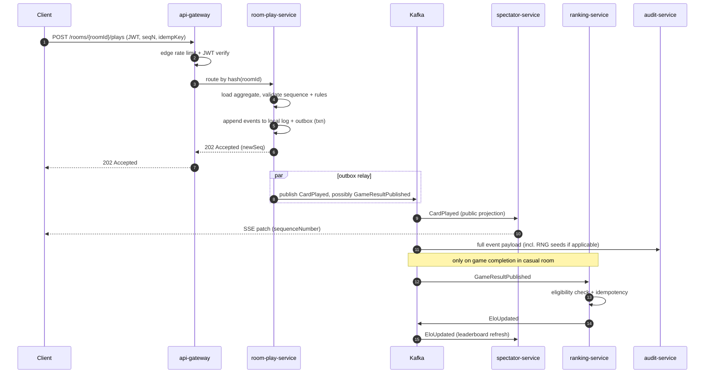
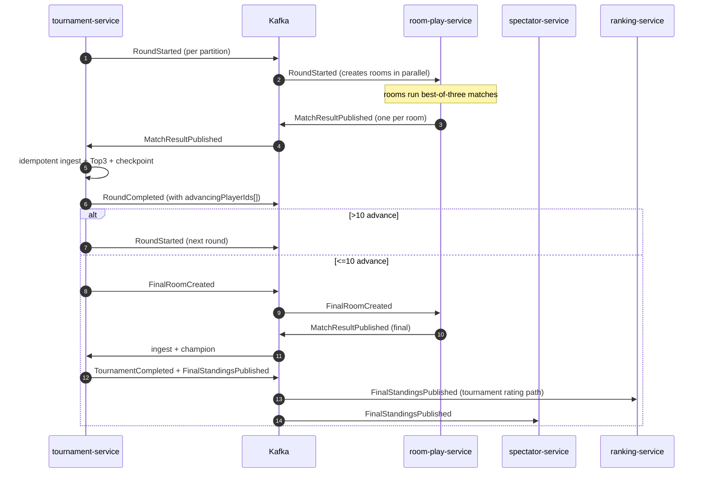
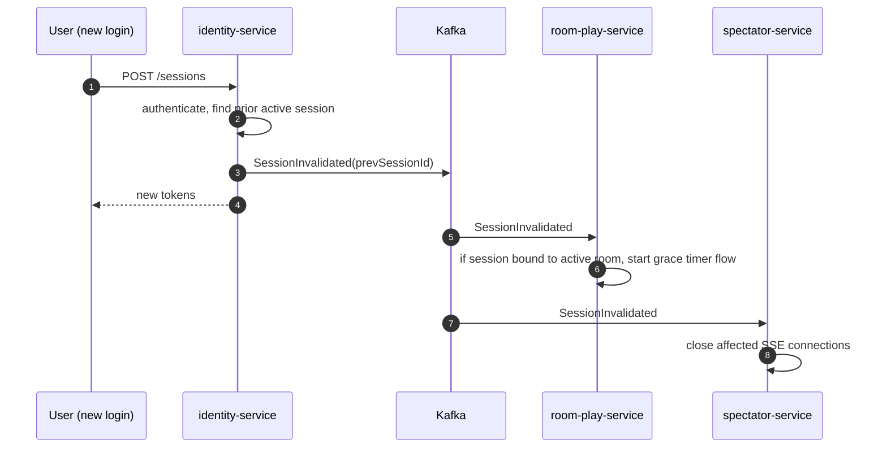

# UnoArena — Architecture Document


## 1. Purpose and Scope

This document defines the **technical architecture** of the UnoArena platform:
the service decomposition, communication patterns, data architecture,
cross-cutting mechanisms, deployment topology, and architectural decision
records that turn the domain model in `DESIGN.md` into a runnable distributed
system.

In scope:

- Logical architecture (services, components, contracts).
- Communication architecture (synchronous APIs, live delivery, event backbone).
- Data architecture (per-service stores, read models, retention).
- Cross-cutting concerns (identity, security, observability, rate limiting).
- Deployment architecture (container platform, scaling, partitioning).
- Architectural decision records and their rationale.
- Traceability from non-functional requirements to architectural mechanisms.

Out of scope:

- Concrete deployment manifests, Helm charts, or Terraform modules.
- Wire-level protocol negotiation (TLS suite, HTTP/2 vs HTTP/3) — left as
  operational detail.
- Production-grade SLO/SLA numbers — placeholders are given so the reader can
  see the intent.

---

## 2. Architectural Drivers

The architecture is driven by a small set of non-negotiable forces from
`REQUIREMENTS.md`:

| ID | Driver | Source | Architectural implication |
|---|---|---|---|
| AD-1 | A single authoritative version of game state at all times | NFR-C1, DR-3 | Per-room **single-writer** model. The Room Play service partitions rooms across instances and routes every command for a room to its current owner. |
| AD-2 | Concurrent or stale actions must not corrupt state | NFR-C2, NFR-C3, FR-R12, DR-9 | Optimistic concurrency at the service boundary using the per-room **monotonic sequence number** defined in the domain model. |
| AD-3 | Massive simultaneous tournament-match completion (up to 100,000 rooms) | NFR-C4, NFR-P3, NFR-SC3, FR-T11 | **Asynchronous, partitioned event backbone**; tournament advancement is an idempotent multi-step process consuming integration events at-least-once. |
| AD-4 | Live, low-latency state visibility for players and spectators | NFR-P1, NFR-P4, FR-S2 | Dedicated **Spectator service** building read-only projections from the event backbone; **SSE** as the live delivery channel. |
| AD-5 | Independent scaling of gameplay, tournaments, ranking, live view, and audit | NFR-SC2 | One service per bounded context, each with its own data store and scaling profile. |
| AD-6 | Authoritative auditability and replayability of every game | FR-A1–FR-A4, DR-7 (log-before-broadcast), DR-16 | **Event sourcing** in the gameplay path: events are appended to the audit log **before** being broadcast or projected. Deterministic RNG seeds are stored per game. |
| AD-7 | Single active session per player; defence against takeover | FR-I2, NFR-SE7, DR-15 | Centralised **Identity service** with explicit `SessionInvalidated` event consumed by all sessionful services. |
| AD-8 | High availability; failures in one capability must not invalidate already accepted results | NFR-R1, NFR-R2 | Loose coupling via async events between contexts; **integration events are immutable** once published; no synchronous cross-service call on the gameplay hot path. |
| AD-9 | Multi-layer rate limiting and adaptive throttling | NFR-SE5 | Rate limits applied at three layers: **edge gateway** (per IP), **identity-aware layer** (per user), and **per-room aggregate** (per command-action). |

These drivers are revisited in section 14 where each NFR is mapped to the
mechanism that satisfies it.

---

## 3. Architectural Style and Principles

### 3.1 Style

UnoArena is a **microservices, event-driven** platform with **CQRS-style read
models** for the high-fanout views. The high-level shape:

- **Bounded-context-per-service.** Each context defined in §2.2 of `DESIGN.md`
  becomes a deployable service. Services own their data and expose contracts
  (REST, SSE, or async events) — never a shared database.
- **Event sourcing in the gameplay hot path.** The Room Play service stores
  every accepted state transition as an event. The aggregate state is rebuilt
  from the event log on demand (recovery, projection, replay).
- **Outbox-pattern publication.** Internal aggregate events are persisted
  atomically with state, then published to the event bus by an outbox relay,
  guaranteeing the log-before-broadcast invariant (DR-7) without distributed
  transactions.
- **Read models / CQRS** on the read-heavy side (Spectator, Ranking
  leaderboards). Read models are derived asynchronously from integration
  events.
- **Synchronous API only for commands and authoritative reads** of a single
  aggregate. Cross-context interactions are asynchronous.

### 3.2 Architectural principles

1. **Authority belongs to the aggregate.** Validation, sequencing, and
   acceptance are the responsibility of the owning service. Other services see
   only published, immutable integration events.
2. **At-least-once delivery; idempotency at every consumer.** Matches
   assumption A1 in `DESIGN.md`. Every consumer carries a deduplication key
   appropriate to its domain (see §6.4).
3. **Single writer per partition key.** The partition key is `roomId` for
   gameplay, `tournamentId` for tournament advancement, and `playerId` for
   ranking and identity.
4. **Privacy at construction, not delivery.** Consistent with DESIGN §7.7 and
   §3.4 of this document: a `SpectatorView` is built without hand contents;
   the data is never present to be leaked. Authorization checks are necessary
   but never the only line of defence.
5. **Schema-first contracts.** Every integration event and external API has a
   versioned schema in a registry. Backwards-incompatible changes require a
   parallel new version, never an in-place mutation.
6. **No client-side authority.** All randomness, scoring, and validation are
   server-side (FR-R28, NFR-SE2, DR-16).

---

## 4. Service Decomposition

### 4.1 Domain services (one per bounded context)

| Service | Bounded context | Domain classification | Owned aggregates |
|---|---|---|---|
| **room-play-service** | Room Play | Core | `Room` (with `Player`, `Turn`, `GameInstance`) |
| **tournament-service** | Tournament | Core | `Tournament` (with `Round`, `RoomMatch`) |
| **ranking-service** | Ranking | Supporting | `PlayerRanking` |
| **spectator-service** | Spectator and Live View | Supporting | `RoomProjection` (read model only) |
| **audit-service** | Audit and Game History | Supporting | `GameLog`, `SystemAuditLog` |
| **identity-service** | Identity and Session | Generic | `UserAccount` (with `Session`) |

### 4.2 Infrastructure / supporting services

These are not domain owners; they exist to make the domain services
compositional and operable.

| Service | Responsibility |
|---|---|
| **api-gateway** | Public ingress, TLS termination, edge rate limiting (per IP), routing, request authentication offload (JWT validation), correlation-id injection. |
| **event-bus** | Apache Kafka cluster carrying integration events between bounded contexts. Partitioning by `roomId` / `tournamentId` / `playerId` (see §10). |
| **schema-registry** | Stores versioned schemas (Avro / Protobuf) for every integration event and external API contract. Producers and consumers pull schemas at startup and validate at the boundary. |
| **object-store** | S3-compatible blob storage for cold audit-log tier and long-term game-log retention (FR-A6). |
| **observability stack** | OpenTelemetry collector, Prometheus (metrics), Loki (logs), Tempo / Jaeger (traces). |
| **secrets / config** | Kubernetes secrets backed by an external KMS for encryption-at-rest of sensitive material (credentials, signing keys). |

### 4.3 Service / context map


The map intentionally has no synchronous arrows between domain services. The
only sync calls outside the gateway are: (a) services validating JWTs against
identity-service's JWKS endpoint (cached), and (b) the optional seeding query from
tournament-service to ranking-service described in `DESIGN.md` §2.3.

---

## 5. Service Catalog

For each service: its responsibility, the contracts it exposes, the data it
owns, and its scaling profile.

### 5.1 room-play-service — Room Play (Core)

**Responsibilities.** Owns the `Room` aggregate. Validates every gameplay
command synchronously, assigns the next sequence number, persists the
resulting events, and publishes integration events. Manages turn timeouts and
the disconnection grace timer.

**Public command API (REST, JSON, JWT).**

Paths are modelled as **resources**, not actions. Each gameplay command creates
an immutable command record under the room (each `POST` returns the
server-assigned id of the created sub-resource and the resulting
`sequenceNumber`); state transitions on long-lived sub-resources use `PUT` /
`PATCH`. All commands carry `{ roomId, sequenceNumber, idempotencyToken,
correlationId }` plus the command payload.

| Verb | Path | Command | Notes |
|---|---|---|---|
| POST | `/rooms` | `CreateRoom` | Returns the new `roomId` in `Location`. |
| GET  | `/rooms/{roomId}` | — | Authoritative room snapshot. |
| POST | `/rooms/{roomId}/players` | `JoinRoom` | Creates a player membership; capacity 2–10. |
| POST | `/rooms/{roomId}/matches` | `StartMatch` | Host-only; creates the match resource. |
| POST | `/rooms/{roomId}/plays` | `PlayCard` | Sequence-checked. |
| POST | `/rooms/{roomId}/draws` | `DrawCard` | Sequence-checked. |
| POST | `/rooms/{roomId}/wild-color-choices` | `ChooseWildColor` | After a wild play. |
| POST | `/rooms/{roomId}/uno-calls` | `CallUno` | Within Challenge Window rules. |
| POST | `/rooms/{roomId}/uno-challenges` | `ChallengeUnoCall` | Within 5 s. |
| PUT  | `/rooms/{roomId}/players/{playerId}/connection` | `ReconnectToRoom` | Body: `{ "state": "connected" }`. Within 60 s. |

Responses follow a small, consistent shape:

- `202 Accepted` with the new `sequenceNumber` and a list of emitted event ids
  on success.
- `409 Conflict` with the current `sequenceNumber` on stale-sequence rejection
  (the client uses this to reconcile from the SSE stream).
- `403 Forbidden` for actor/role violations (DR-5, DR-8).
- `429 Too Many Requests` from the rate limiter (NFR-SE5).

**Asynchronous output (events to event-bus).**

- *Internal events* persisted locally and published as the Audit feed.
- *Integration events* with versioned, value-object payloads:
  `GameResultPublished`, `MatchResultPublished`.

**Asynchronous input.**

- `RoundStarted` and `FinalRoomCreated` from tournament-service (room creation
  for tournament rounds).
- `SessionInvalidated` from identity-service (triggers the grace timer flow).

**Owned data.**

- **Postgres `room-play`**: per-room event log + current snapshot. Schema:
  `events(room_id, sequence_number, type, payload_json, server_ts)`,
  `room_snapshot(room_id, current_sequence_number, state_json, version)`.
  Partitioned by `room_id` hash.
- **Redis**: per-room timers (turn timeout, grace timer, challenge window),
  and a presence map for active connections used to detect disconnections
  quickly.

**Scaling profile.** Horizontal scaling through **room sharding**. The
gateway routes every command for a `roomId` to the same room-play-service pod via
a consistent-hashing layer. Within a pod, each owned room has a
single in-memory aggregate handler protected by an actor-style mailbox so the
single-writer invariant holds without distributed locks.

### 5.2 tournament-service — Tournament (Core)

**Responsibilities.** Owns `Tournament`. Generates brackets, ingests
`MatchResultPublished` from rooms, determines top-3 advancers (with the
tie-breakers from §1.2 of `DESIGN.md`), advances rounds, and creates the
final room.

**Public command API.**

The tournament lifecycle and the registration window are modelled as
sub-resources whose **state** is mutated with `PUT`. Individual player
registrations are a collection (`/registrations`) populated with `POST`.

| Verb | Path | Command / Purpose | Notes |
|---|---|---|---|
| POST   | `/tournaments` | `CreateTournament` | Returns `tournamentId` in `Location`. |
| GET    | `/tournaments/{id}` | — | Read model: bracket state, round status. |
| PUT  | `/tournaments/{id}` | `CancelTournament` | Body: `{ "status": "cancelled" }`. State-transition update. |
| PUT    | `/tournaments/{id}` | `OpenRegistration` / `CloseRegistration` | Body for registration: `{ "open": true \| false }` |
| POST   | `/tournaments/{id}/registrations` | `RegisterForTournament` | Body: `{ "playerId": "..." }`. Creates one registration. |
| DELETE | `/tournaments/{id}/registrations/{playerId}` | `WithdrawRegistration` | Optional; only allowed while the window is open. |

**Asynchronous output.** `RoundStarted`, `FinalRoomCreated`,
`FinalStandingsPublished`, `TournamentCancelled`. The first two trigger room
creation in room-play-service; the third drives the tournament-placement rating
update in ranking-service.

**Asynchronous input.** `MatchResultPublished` from room-play-service.

**Owned data.** Postgres `tournament`. Brackets and round state stored
relationally; the tournament aggregate is reconstructed from a small
event-sourced view per tournament for advancement-step recovery. Idempotency table `processed_match_results(roomMatchId,
matchResultVersion)`.

**Scaling profile.** Horizontal; partition by `tournamentId`. Within a
single tournament the advancement pipeline is a single-writer process
manager, but per-room result ingestion is parallelised inside that
partition.

### 5.3 ranking-service — Ranking (Supporting)

**Responsibilities.** Maintains `PlayerRanking` per player (casual Elo +
tournament-placement rating). Computes deltas from `GameResultPublished` and
`FinalStandingsPublished`. Serves the leaderboard and player profile reads.

**Public read API (REST + SSE).**

All endpoints are `GET` on noun resources. The leaderboard endpoints support
both a JSON snapshot and a live stream selected via the `Accept` header
(`application/json` vs `text/event-stream`); the `Last-Event-ID` header is
honoured on reconnect for SSE.

| Verb | Path | Purpose | Notes |
|---|---|---|---|
| GET | `/players/{playerId}/ranking` | Current ratings (casual + tournament) | — |
| GET | `/players/{playerId}/rating-history` | Paginated rating history | Query: `?type=casual\|tournament&page=...`. |
| GET | `/leaderboards/casual` | Casual Elo leaderboard | `Accept: application/json` for a page; `Accept: text/event-stream` for live updates. |
| GET | `/leaderboards/tournament` | Tournament-placement leaderboard | Same content negotiation. |

**Asynchronous input.** `GameResultPublished` (Elo path), `FinalStandingsPublished`
(tournament-placement path). Both with consumer-side ACL applying eligibility
(`isAbandoned`, `cancelled`) and idempotency keys (DESIGN §4.3).

**Owned data.** Postgres `ranking`: `player_ranking`, `rating_history`,
`processed_results(idempotency_key)`. Read-side leaderboards backed by
materialised views refreshed on event consumption.

**Scaling profile.** Horizontal; partition by `playerId`. Read traffic on
leaderboards is heavy, so the read-side has a CDN-friendly cache layer at
the gateway with short TTLs and SSE invalidation channels.

### 5.4 spectator-service — Spectator and Live View (Supporting)

**Responsibilities.** Builds and serves read-only projections to players
(`PlayerView`) and spectators (`SpectatorView`). Enforces hand privacy at
**projection construction time**, never at delivery time.

**Public live API (SSE).**

The two view classes — `PlayerView` and `SpectatorView` — are exposed as
distinct sub-resources under the room (their representations carry different
data; they are not the same resource served two ways). The tournament view is
a single resource with content negotiation. SSE is selected via
`Accept: text/event-stream`; a JSON snapshot is also available with
`Accept: application/json` for clients that only need a one-shot read.

| Verb | Path | Purpose | Notes |
|---|---|---|---|
| GET | `/rooms/{roomId}/player-view` | The caller's `PlayerView` (own hand + public state) | JWT must bind to a `playerId` enrolled in the room. |
| GET | `/rooms/{roomId}/spectator-view` | Public `SpectatorView` (no hands, no RNG seeds) | Role-checked. |
| GET | `/tournaments/{tournamentId}` | Bracket + round progression projection | Served by spectator-service for live; the JSON snapshot is also available from tournament-service (§5.2). |

Each SSE response carries an initial **snapshot** event followed by
sequence-numbered **patch** events; a client reconnecting includes a
`Last-Event-ID` so the service replays from that point (DESIGN §6.4).

**Asynchronous input.** All public Room Play internal events plus integration
events from tournament-service, ranking-service.

**Owned data.** Postgres `spectator`: per-room `PlayerView` and
`SpectatorView` projection state, append-only patch log per room.
Redis: short-lived snapshot cache for spectator views to absorb fan-out.

**Scaling profile.** Read-heavy and fan-out-heavy. Horizontal; partition by
`roomId` for projection construction, then a thin SSE fan-out tier in front
that holds long-lived connections. The fan-out tier scales independently
from the projection tier.

### 5.5 audit-service — Audit and Game History (Supporting)

**Responsibilities.** Owns `GameLog` and `SystemAuditLog`. Append-only;
indexes for replay (`gameId` → ordered events) and for sensitive-operation
queries (actor / target / type).

**Public read API.**

`GameLog` and `SystemAuditLog` are modelled as collections of immutable
entries. Replay is a derived representation of the game log (negotiated via
`Accept`).

| Verb | Path | Purpose | Notes |
|---|---|---|---|
| GET | `/games/{gameId}/log-entries` | Full ordered event log of a game | Privileged role. Pagination via `?cursor=...`. |
| GET | `/games/{gameId}` | Game replay | `Accept: application/x-replay-stream` returns the deterministic re-execution using the stored RNG seeds (FR-A3, FR-A4); `Accept: application/json` returns metadata only. |
| GET | `/system-audit-entries` | Sensitive-operation audit query | Admin-only. Filters: `?actorId=...&targetId=...&type=...&from=...&to=...`. |

**Asynchronous input.** Every domain integration event from every service.
audit-service is the **superset consumer**: it receives more than
spectator-service, including private hand contents and RNG seeds.

**Owned data.** Postgres `audit` for the hot tier (recent N days); object
store (S3-compatible) for the cold tier. Both are append-only; retention
policies are configurable per record class (FR-A6).

**Scaling profile.** Write-throughput-dominated; horizontal partitioning by
`gameId` for `GameLog`, by `entryId` time-bucket for `SystemAuditLog`.

### 5.6 identity-service — Identity and Session (Generic)

**Responsibilities.** User registration, authentication, JWT issuance, session
lifecycle, role administration. Enforces single-active-session per user
(DR-15) and emits the explicit events catalogued in `DESIGN.md` §3.6:
`LoginAttempted`, `SessionStarted`, `SessionInvalidated`, `SessionRefreshed`,
`RoleChanged`.

**Public API.**

Sessions, tokens, and role assignments are first-class resources. Login is
the creation of a session; logout is its deletion; refresh is the rotation of
the session's tokens (`PUT` on the tokens sub-resource). Role administration
is a sub-collection of each user.

| Verb | Path | Purpose | Notes |
|---|---|---|---|
| POST   | `/users` | Register a new account | Body: `{ "username", "password", ... }`. |
| POST   | `/sessions` | Create a session (login) | Body: credentials. Returns access + refresh tokens. Triggers `SessionInvalidated` for any prior active session (DR-15). |
| GET    | `/sessions/current` | Read the caller's session metadata | — |
| PUT    | `/sessions/current/tokens` | Rotate access + refresh tokens | Body: `{ "refreshToken": "..." }`. Replaces the session's token pair. |
| DELETE | `/sessions/current` | Logout (explicit invalidation) | — |
| GET    | `/.well-known/jwks.json` | Public keys for downstream JWT validation | Standard well-known URI; cached aggressively. |
| GET    | `/users/{userId}/roles` | List a user's roles | Admin or self. |
| PUT    | `/users/{userId}/roles/{role}` | Assign a role to a user | Admin-only. Idempotent. |
| DELETE | `/users/{userId}/roles/{role}` | Revoke a role | Admin-only. |

**Asynchronous output.** All Identity events (above) flow to audit-service via the
event bus. `SessionInvalidated` additionally flows to room-play-service and
spectator-service to evict subscriptions.

**Owned data.** Postgres `identity`: `user_account`, `credentials`, `session`,
`role_assignment`. Bcrypt/argon2 for password hashes; signing keys held in
the secrets store and rotated.

**Scaling profile.** Low write throughput, moderate read (JWKS is cached
aggressively). Horizontal; stateless once tokens are issued.

---

## 6. Communication and Integration

### 6.1 Synchronous: REST commands and authoritative reads

- **Transport.** HTTP/1.1 + TLS. JSON payloads. Optional HTTP/2 between the
  gateway and services for header compression.
- **Authentication.** JWT bearer tokens issued by identity-service. Validated at
  the gateway against cached JWKS; the gateway forwards a verified
  `X-User-Id` and `X-Roles` header so downstream services do not re-verify.
  Service-to-service calls inside the cluster use mTLS (service mesh).
- **Idempotency.** Every state-changing request carries:
  - `Idempotency-Key`: a per-session nonce that the receiving service stores
    for a configurable retention window. A repeat with the same key returns
    the previous response.
  - `X-Sequence-Number`: the client's known room sequence number. Mismatch
    yields `409 Conflict` with the current value (see §5.1 for shape).
- **Correlation.** A `X-Correlation-Id` is generated by the gateway if
  absent; it is propagated through every event and log entry.

### 6.2 Live state delivery: Server-Sent Events

SSE is the chosen transport for live updates from spectator-service to clients,
and from ranking-service for streaming leaderboards.

Rationale:

- Naturally append-only — matches the underlying event-sourced model.
- HTTP-only — flows through any standard load balancer / proxy / CDN.
- Built-in `Last-Event-ID` reconnection semantics simplify the
  state-reconciliation flow described in `DESIGN.md` §6.4.
- One-way fan-out from server to client is exactly the access pattern; the
  client never pushes via the same channel — commands always go through REST.

Connection lifecycle:

1. Client opens the stream with a JWT and a target `roomId` (or
   `tournamentId`).
2. spectator-service resolves the role → builds the appropriate projection class
   (`PlayerView` if the caller is in the room, `SpectatorView` otherwise).
3. First event is a `snapshot` (full current projection); subsequent events
   are `patch` events keyed by `sequenceNumber`.
4. On reconnect, `Last-Event-ID` is honoured: the service replays missed
   patches from its append-only patch log.

WebSocket was rejected for now (see ADR-3); it remains a future option if
bidirectional in-band requirements emerge.

### 6.3 Asynchronous: event bus

- **Broker.** Apache Kafka.
- **Topic strategy.** One topic per integration event type
  (`room-play.GameResultPublished`, `room-play.MatchResultPublished`,
  `tournament.RoundStarted`, `identity.SessionInvalidated`, etc.). Audit
  consumes a multi-topic feed.
- **Partition keys.**
  - Room Play events: `roomId` — preserves per-room ordering (DESIGN A2).
  - Tournament events: `tournamentId`.
  - Ranking events: `playerId`.
  - Identity events: `userId`.
- **Delivery semantics.** At-least-once (DESIGN A1). Producers use
  idempotent Kafka producers; consumers commit offsets only after the
  application-level idempotency check has succeeded.
- **Outbox pattern.** Producing services persist the event to a local
  `outbox` table in the same transaction that commits the aggregate state.
  A relay process publishes from the outbox to Kafka. This guarantees
  log-before-broadcast (DR-7, FR-A1) and exactly-once write to the source of
  truth, even when the broker is unavailable.
- **Dead-letter handling.** Consumers route poison events to a per-topic DLQ
  topic with the error reason and original payload, alerting the on-call.

### 6.4 Idempotency keys at consumers

The keys below are the contract; they appear in the consumer's own
deduplication table.

| Consumer | Source event | Idempotency key |
|---|---|---|
| tournament-service | `MatchResultPublished` | `{roomMatchId, matchResultVersion}` |
| ranking-service (Elo) | `GameResultPublished` | `{gameId, sequenceNumber}` |
| ranking-service (tournament rating) | `FinalStandingsPublished` | `{tournamentId, finalStandingsVersion}` |
| audit-service | any | `{eventId}` (UUID assigned at production) |
| spectator-service | any | `{streamId, sequenceNumber}` |

### 6.5 Schema and contract management

- All integration events are defined in **Avro** schemas (alternative:
  Protobuf), with a versioned schema-registry entry. Producers fail fast at
  startup if their schema is incompatible.
- Backwards-compatible evolutions (adding optional fields, widening enums) are
  in-place. Backwards-incompatible changes use a new event name
  (`...PublishedV2`) and a transitional period during which both versions are
  emitted.
- External REST APIs use OpenAPI 3 specifications stored alongside the
  service code.

---

## 7. Data Architecture

### 7.1 Per-service stores

| Service | Primary store | Auxiliary store | Notes |
|---|---|---|---|
| room-play-service | Postgres (per-room event log + snapshot) | Redis (timers, presence) | Event-sourced. Snapshots compact recovery time. |
| tournament-service | Postgres (relational + processed-results table) | — | Process-manager checkpointing. |
| ranking-service | Postgres (player_ranking, rating_history) | Read-side cache (Redis) | Materialised leaderboards refreshed on consumption. |
| spectator-service | Postgres (projection state + patch log) | Redis (snapshot cache, SSE backpressure buffer) | Read-only relative to authoritative state. |
| audit-service | Postgres (hot tier, append-only) | Object store (cold tier) | Cold tier is partitioned by month. |
| identity-service | Postgres (accounts, sessions, roles) | Secret store (signing keys) | Single source of truth for identity. |

### 7.2 Read models and CQRS

CQRS is applied to read-heavy projections, **not** to the gameplay write
path:

- **Spectator projections** are pure read models — built only from events,
  never authoritative.
- **Ranking leaderboards** are read models derived from `PlayerRanking`
  state; they can be rebuilt from the rating_history and the integration
  event stream if corrupted.
- **Tournament bracket views** are exposed via a thin projection on top of
  the relational state.

### 7.3 Retention

- **Hot game logs**: 90 days in audit-service Postgres (placeholder, FR-A6).
- **Cold game logs**: object store, retained per policy. Tournament logs
  retained longer than casual logs (DESIGN A9).
- **System audit log**: indefinitely for security-class entries (login
  attempts, session invalidations, role changes), per institutional policy.
- **Event-bus retention**: 7 days for hot replay; cold replay reconstructed
  from audit-service.

### 7.4 RNG and seed handling

Every `GameStarted` and `DrawPileReshuffled` event carries the RNG seed used
to produce its randomness (DESIGN §3.1, FR-R28, DR-16). Seeds are:

- Generated **server-side** by room-play-service using a CSPRNG.
- Persisted with the event, never sent to clients.
- Consumed by audit-service for replay (the replay service rehydrates the same
  seed-driven shuffle/draw sequence).

---

## 8. Cross-Cutting Concerns

### 8.1 Identity, authorisation, and session

- **JWT** access tokens (short-lived, ~15 min) + refresh tokens (longer,
  rotated on use).
- **Single-active-session.** identity-service tracks the active `sessionId` per
  user; on a new login it issues `SessionInvalidated` for the prior session.
  Downstream services consume this event and:
  - room-play-service evicts the session's command authority and triggers the
    grace-timer flow if the session was bound to an active room.
  - spectator-service closes the affected SSE connections.
- **Role-based authorisation.** Roles in the JWT (`player`, `spectator`,
  `tournament_operator`, `admin`) are enforced at the service boundary; the
  gateway performs a coarse pre-check, the owning service applies the fine
  check (DR-5, DR-8).

### 8.2 Rate limiting (NFR-SE5)

Three layers, in series:

1. **Edge (api-gateway).** Per-IP token-bucket; protects against blunt
   flooding.
2. **Identity-aware (api-gateway, post-auth).** Per-user limit on commands
   per time window; harder limit on auth endpoints.
3. **Aggregate-level (room-play-service, tournament-service).** Per-room and
   per-action limits applied **after** the command reaches the owning service
   but **before** mutation. This catches abuse that single-IP / single-user
   limits can miss when a coordinated attacker has many sessions targeting
   one room.

Limits are configurable (DESIGN A6) and surfaced through metrics so
operators can tune them.

### 8.3 Observability

- **Tracing.** OpenTelemetry; the gateway injects a trace context that flows
  through REST, into the outbox row, into the Kafka headers, and into the
  consumer span. Every domain event carries the originating
  `correlationId` (`DESIGN.md` §2.4).
- **Metrics.** Prometheus pull. Key SLIs:
  - `room_play.command_latency_p99` (target: <100 ms — placeholder).
  - `room_play.sequence_rejection_rate` — informational; high rate may
    indicate client clock skew or mass reconnects.
  - `tournament.advancement_lag` — time between last room result and
    `RoundCompleted`.
  - `ranking.event_consumption_lag`.
  - `event_bus.outbox_relay_lag`.
- **Logs.** Structured JSON, shipped to Loki. Every log entry carries
  `correlationId` and `roomId` / `tournamentId` / `playerId` where known.

### 8.4 Security

- **Transport.** TLS at the edge; mTLS between services via the service
  mesh.
- **Secrets.** External KMS-backed secret store; signing keys rotated; never
  logged.
- **Input validation.** At every service boundary; schemas enforced via the
  registry (NFR-SE6).
- **Audit-grade integrity.** Sensitive operations (login, role change,
  tournament cancellation) are signed with a dedicated key before being
  appended to `SystemAuditLog`. Verification is part of the replay path.
- **Replay attack defence.** Three independent guards (DESIGN §5.5): session
  invalidation, monotonic sequence number, per-session idempotency token.

### 8.5 Schema registry

- Producers must register their schema before publishing.
- Consumers fetch and cache the schema; an incompatible upgrade fails the
  consumer's startup health check rather than corrupting data silently.

---

## 9. Reliability and Failure Modes

### 9.1 Per-service failure modes

| Failure | Containment | Recovery |
|---|---|---|
| room-play-service pod crash | Affected rooms become temporarily unavailable; clients see SSE drop and `503` on commands. | A surviving pod claims ownership via the partition coordinator (§10.1) and rebuilds room state from the event log + last snapshot. Outstanding commands are retried by the client; stale-sequence rejections reconcile state. |
| tournament-service pod crash mid-advancement | Advancement pauses for the affected tournament partition. | Process manager resumes from last checkpoint (DESIGN §7.3). Steps are idempotent. |
| ranking-service unavailable | Leaderboards stale; gameplay unaffected (NFR-R2). | Backlog drained on recovery; idempotency prevents double-update. |
| spectator-service unavailable | Live views unavailable; gameplay unaffected. | Projections rebuilt from events on restart; clients reconnect with `Last-Event-ID`. |
| audit-service unavailable | New events buffered in Kafka with extended retention; gameplay continues. | Backlog drained on recovery. |
| identity-service unavailable | New logins/refreshes fail; existing JWTs remain valid until expiry; gameplay continues for in-flight sessions. | Standard rolling restart; signing keys remain in secret store. |
| Kafka unavailable | Outbox relay buffers; producers' transactions still commit locally; integration events delayed. | Relay drains on recovery. |
| Postgres unavailable for a service | That service degrades; circuit-break to maintenance mode. | Restore from PITR backup if necessary; gameplay paused for affected rooms only. |

### 9.2 Cross-context failure scenarios

These are the architectural realisations of the scenarios in `DESIGN.md`
§5.4. The mechanism column shows where the protection lives in this
architecture.

| Scenario | Mechanism |
|---|---|
| Room emits result, Tournament misses it. | Kafka retention + consumer lag monitoring; idempotent re-consumption keyed by `{roomMatchId, matchResultVersion}`. |
| Tournament crashes mid-advancement. | Idempotent process-manager steps with checkpointing in tournament-service Postgres. |
| Ranking fails to apply Elo. | Backlog in Kafka; consumer-side ACL re-applies eligibility on retry. |
| Audit unavailable. | Outbox decouples production from audit consumption; events accumulate; appended in order on recovery. |

### 9.3 Backpressure

- **SSE backpressure.** Per-client send queue with a bounded buffer; on
  overflow the connection is closed and the client reconnects with
  `Last-Event-ID`. Better than silently dropping patches.
- **Kafka backpressure.** Producers back off when the broker is slow; this
  pushes back into outbox accumulation, which is bounded by configurable
  alerts (NFR-R1).
- **Command rate limiting** (§8.2) provides upstream backpressure against
  abusive clients.

---

## 10. Scaling Strategy and Partitioning

### 10.1 Room sharding (room-play-service)

The most demanding NFR is **single-writer-per-room** (AD-1) under massive
horizontal scale (NFR-SC1, NFR-P2). The architecture does it as follows:

1. The gateway computes `partition = consistentHash(roomId) % N` for routing.
2. A **partition coordinator** (Kafka consumer-group rebalance, or a
   dedicated component on top of an etcd / ZooKeeper lock) assigns each
   partition to exactly one room-play-service pod.
3. Inside the pod, each owned room has an **in-memory aggregate handler**
   guarded by an actor-style mailbox. All commands for the room flow
   through that mailbox sequentially. The sequence number is therefore
   serialised by the runtime, not by a database lock.
4. State changes are persisted via the outbox transaction (§6.3) before the
   handler returns success to the client. This satisfies log-before-broadcast.
5. On pod failure the coordinator rebalances: another pod claims the
   partition, rebuilds each room from snapshot + event log, and resumes.

Trade-off: the single-writer property requires routing affinity. The
gateway's consistent-hashing ring tolerates pod churn; brief command rejects
during a rebalance are observable as `409` and reconciled by the client via
the SSE stream.

### 10.2 Tournament partitioning

`tournamentId` partitions naturally. Within a tournament the advancement
process is single-writer; per-room match-result ingestion is parallelised
inside that single writer using idempotent steps.

### 10.3 Spectator fan-out

The fan-out tier scales independently from the projection-build tier.
Projection state is partitioned by `roomId`; the fan-out tier holds long-lived
SSE connections and is essentially stateless beyond its connection table.
This separation lets us add fan-out capacity for spectator-heavy events
(e.g., a featured tournament final) without touching the projection
pipeline.

### 10.4 Burst absorption (NFR-P3, NFR-C4)

- Tournament round starts: pre-warm room-play-service partitions before
  emitting `RoundStarted`; the event bus and the gateway hold the burst.
- Tournament round completion: the bottleneck is tournament-service's
  advancement consumer. Each step is idempotent and parallelises across
  per-room ingestion. Backlog is bounded by Kafka retention and monitored
  by `tournament.advancement_lag`.

---

## 11. Security Architecture

This section consolidates security mechanisms; they are also referenced
in §6, §8, and §9.

### 11.1 Threat model summary

The attacker classes considered (DESIGN §5.5):

- **External brute-force / credential stuffing** → edge rate limit + adaptive
  throttle + monitored login-attempt audit.
- **Session takeover** → single-active-session + `SessionInvalidated` event.
- **Replay of captured commands** → triple guard (sequence number,
  idempotency token, session token).
- **Result manipulation** → server-authoritative state + RNG seed audit
  trail + signed sensitive operations.
- **Spectator channel abuse** → privacy at projection construction.

### 11.2 Defence-in-depth layout

```
[ Internet ] → [ TLS / WAF / DDoS edge ] → [ api-gateway ]
                                              │ (auth + edge rate limit)
                                              ▼
                                        [ service mesh ]
                                              │ (mTLS, identity-aware policies)
                                              ▼
                                       [ domain services ]
                                              │ (aggregate-level rate limit,
                                              │  domain invariants, audit)
                                              ▼
                                        [ stores + bus ]
                                              │ (encryption at rest,
                                              │  signed sensitive entries)
```

### 11.3 Logging and audit

- Every authentication event is appended to `SystemAuditLog` regardless of
  outcome (FR-A7).
- Privileged endpoints (admin, tournament-operator) require step-up
  validation and produce an audit entry with the `actorId`, `targetId`,
  and `correlationId`.

---

## 12. Deployment and Infrastructure

### 12.1 Runtime

- **Orchestrator.** Kubernetes. One namespace per environment
  (`dev`, `staging`, `prod`).
- **Service mesh.** Istio (or Linkerd) for mTLS, retry/timeout policies,
  and traffic shaping.
- **Ingress.** A managed L7 ingress in front of api-gateway pods.

### 12.2 Topology

- Each domain service is deployed as a Deployment with a HorizontalPodAutoscaler
  driven by command latency (room-play-service) or consumer lag (tournament-service,
  ranking-service, spectator-service, audit-service).
- Stateful workloads (Postgres, Kafka, Redis) run as managed services or
  StatefulSets with persistent volumes; backups are automated and
  point-in-time-recovery is enabled.

### 12.3 Configuration

- All configuration via environment variables loaded from ConfigMaps;
  secrets via KMS-backed Secrets.
- Per-environment overlays through Kustomize / Helm values.

### 12.4 CI/CD

- Trunk-based development. Every merge runs unit tests, contract tests
  against the schema registry, and an integration test suite that exercises
  the event-bus path.
- Progressive delivery: new versions roll out per service, in canary form,
  monitored against the SLI dashboard before full rollout.

---

## 13. Key End-to-End Flows (architectural view)

### 13.1 Casual game: PlayCard → ranking refresh



### 13.2 Tournament round advancement



### 13.3 Session takeover via new login



---

## 14. Architecture Decision Records

The ADRs below capture the choices that shape the rest of the document. Each
is short on purpose; the supporting reasoning is in the referenced sections.

### ADR-1 — Microservices aligned with bounded contexts

**Decision.** Each bounded context from `DESIGN.md` becomes a deployable
service with its own data store.

**Context.** NFR-SC2 requires independent scaling per capability. NFR-M1
requires clean context separation.

**Consequences.** Higher operational complexity than a monolith, offset by
independent scaling, isolation of failure modes, and cleaner contracts.

### ADR-2 — Kafka as the event backbone with outbox publication

**Decision.** Apache Kafka with the transactional outbox pattern.

**Context.** AD-3, AD-6, AD-8. Need at-least-once cross-context delivery,
log-before-broadcast (DR-7), and resilience under burst load (NFR-P3,
NFR-C4).

**Alternatives considered.** RabbitMQ (lower throughput, weaker partition
semantics). Pulsar (viable; Kafka chosen for ecosystem maturity in academic
context).

### ADR-3 — SSE for live state, REST for commands

**Decision.** REST (HTTP/1.1+TLS, JSON) for commands; SSE for live state
delivery to clients.

**Context.** AD-4. The Spectator/PlayerView model is naturally a one-way
append stream; SSE matches it without the bidirectional complexity of
WebSocket.

**Alternatives considered.** WebSocket (rejected for now — adds
bidirectionality we do not need; commands are already authoritatively
validated through REST). gRPC streaming (rejected for client simplicity).

### ADR-4 — Event sourcing only in Room Play

**Decision.** room-play-service is event-sourced. Other services are
state-store-based with event-driven inputs/outputs.

**Context.** Room Play has the strictest replayability and fairness
requirements (FR-A3, FR-A4, NFR-SE4). The other contexts benefit from
relational query ergonomics and do not need full replay.

### ADR-5 — Single-writer-per-room via partition affinity

**Decision.** The gateway routes by `consistentHash(roomId)` and the
partition coordinator assigns each partition to one room-play-service pod, where
an actor-style mailbox serialises commands.

**Context.** AD-1, AD-2, NFR-C1, NFR-C3. A database lock per command would
not meet NFR-P1 latency at scale.

**Alternatives considered.** Optimistic concurrency at the database layer
only (rejected: race window between read and write at peak throughput).
Distributed locks (rejected: latency and fragility).

### ADR-6 — Idempotent multi-step process manager for tournament advancement

**Decision.** Tournament advancement is a process manager whose steps are
idempotent and individually checkpointed.

**Context.** AD-3. NFR-C4 demands correctness under burst result ingestion.
Cross-service distributed transactions are infeasible.

**Cross-reference.** `DESIGN.md` §6.2 and §7.3.

### ADR-7 — Per-service Postgres + Redis for ephemeral state

**Decision.** Postgres for durable per-service state; Redis for ephemeral,
high-churn state (timers, presence, fan-out caches).

**Context.** Mature, well-understood operational profile; matches the
academic-project constraint of avoiding niche stores.

### ADR-8 — Identity centralised; downstream services validate JWTs only

**Decision.** identity-service is the only service that talks to the credential
store. Other services consume signed JWTs and the `SessionInvalidated`
event.

**Context.** AD-7, NFR-SE7, DR-15.

### ADR-9 — Schema registry as the contract enforcement point

**Decision.** All integration events have versioned schemas; producers and
consumers fail closed on incompatibility.

**Context.** NFR-M2 (evolvability). Prevents silent schema drift.

---

## 15. Traceability: NFR → architectural mechanism

| NFR | Mechanism in this architecture |
|---|---|
| NFR-P1 (low-latency state propagation) | In-memory aggregate handler in room-play-service; outbox + Kafka fanout; SSE patches. |
| NFR-P2 (high concurrent throughput) | Room sharding (§10.1); horizontal scaling per service. |
| NFR-P3 (burst tolerance) | Kafka as buffer; idempotent consumers; pre-warmed partitions on `RoundStarted`. |
| NFR-P4 (many concurrent live consumers) | Spectator fan-out tier (§10.3); SSE; CDN-cacheable static parts of leaderboards. |
| NFR-SC1 / NFR-SC2 | Service-per-context (ADR-1); HPAs (§12.2). |
| NFR-SC3 (1M tournament players) | tournamentId partitioning + idempotent process manager (ADR-6). |
| NFR-C1 / NFR-C2 / NFR-C3 | Single-writer-per-room (ADR-5); sequence numbers; outbox. |
| NFR-C4 | Idempotent multi-step advancement (ADR-6). |
| NFR-C5 | Idempotency keys at ranking-service (§6.4). |
| NFR-R1 / NFR-R2 / NFR-R3 / NFR-R4 | Async coupling via Kafka; outbox; event-sourced room state; PITR backups; immutable audit log. |
| NFR-SE1 / NFR-SE2 | Server-authoritative validation in room-play-service; deterministic RNG with stored seeds. |
| NFR-SE3 | RBAC at gateway and service boundary; service mesh policies. |
| NFR-SE4 | Audit-service with replayable game logs; correlation IDs end-to-end. |
| NFR-SE5 | Three-layer rate limiting (§8.2). |
| NFR-SE6 | Schema registry; signed sensitive operations; mTLS. |
| NFR-SE7 | identity-service + `SessionInvalidated` event (ADR-8). |
| NFR-M1 / NFR-M2 / NFR-M3 / NFR-M4 | Service-per-context; schema-registry-managed contracts; ubiquitous language preserved across services. |

---

## 16. Open Questions and Future Work

These are deliberately deferred; they do not block the architecture but will
need to be resolved before a production engagement.

| # | Question | Why deferred |
|---|---|---|
| AQ-1 | Exact horizontal autoscaling thresholds (room-play-service CPU, Kafka consumer lag triggers, SSE-fan-out connection counts). | Operational tuning; needs load-test data. |
| AQ-2 | Multi-region deployment topology for tournaments above the regional capacity envelope. | Out of scope for the academic deliverable; relevant for true 1M-player events. |
| AQ-3 | Long-term cold-tier audit storage costs and migration cadence. | Depends on retention policy that is itself a stakeholder decision (DESIGN A9). |
| AQ-4 | Whether to add WebSocket as an alternative live channel for clients on networks where SSE is troublesome. | ADR-3 left this as future option; data needed first. |
| AQ-5 | Tournament-placement rating formula. | Tracked in `DESIGN.md` Q3; affects only ranking-service internals. |
| AQ-6 | Schema-evolution policy for major versions (parallel-emit duration, deprecation timeline). | Operational policy. |

---

## 17. Cross-references

- `REQUIREMENTS.md` — functional and non-functional requirements (the
  authoritative source of `FR-*`, `NFR-*`, `DR-*` identifiers cited above).
- `DESIGN.md` — domain model, ubiquitous language, aggregates, integration
  event contracts, edge-case analysis, and consistency strategy. Every
  service in §5 implements one of its bounded contexts; every event in §6
  is defined there.
