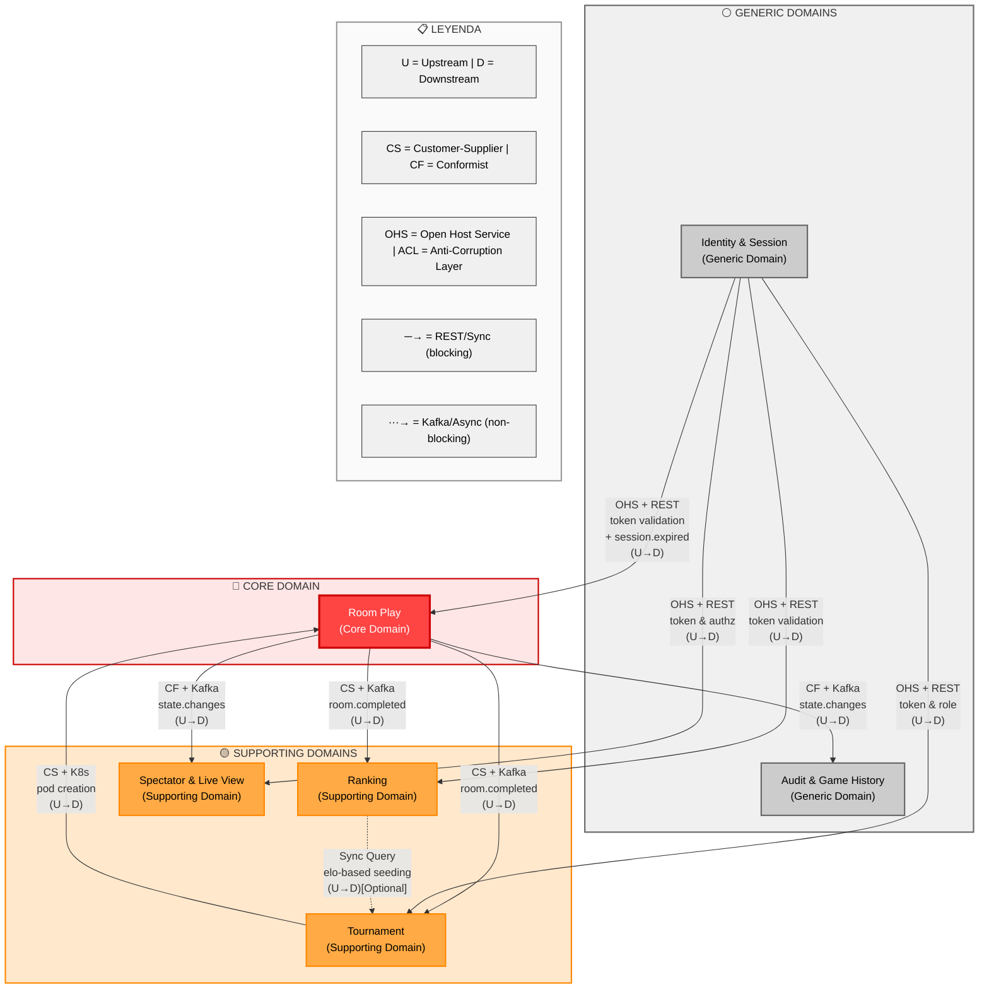

```mermaid

flowchart TB
    subgraph Core["🔴 CORE DOMAIN"]
        RoomPlay["Room Play<br/>(Core Domain)"]
        style RoomPlay fill:#ff4444,stroke:#cc0000,color:#fff,stroke-width:3px
    end

    subgraph Supporting["🟡 SUPPORTING DOMAINS"]
        Tournament["Tournament<br/>(Supporting Domain)"]
        Ranking["Ranking<br/>(Supporting Domain)"]
        Spectator["Spectator & Live View<br/>(Supporting Domain)"]
        style Tournament fill:#ffaa44,stroke:#ff8800,color:#000,stroke-width:2px
        style Ranking fill:#ffaa44,stroke:#ff8800,color:#000,stroke-width:2px
        style Spectator fill:#ffaa44,stroke:#ff8800,color:#000,stroke-width:2px
    end

    subgraph Generic["⚪ GENERIC DOMAINS"]
        Audit["Audit & Game History<br/>(Generic Domain)"]
        Identity["Identity & Session<br/>(Generic Domain)"]
        style Audit fill:#cccccc,stroke:#666666,color:#000,stroke-width:2px
        style Identity fill:#cccccc,stroke:#666666,color:#000,stroke-width:2px
    end

    %% Room Play -> Tournament
    RoomPlay -->|"CS + Kafka<br/>room.completed<br/>(U→D)"| Tournament

    %% Room Play -> Ranking
    RoomPlay -->|"CS + Kafka<br/>room.completed<br/>(U→D)"| Ranking

    %% Room Play -> Spectator
    RoomPlay -->|"CF + Kafka<br/>state.changes<br/>(U→D)"| Spectator

    %% Room Play -> Audit
    RoomPlay -->|"CF + Kafka<br/>state.changes<br/>(U→D)"| Audit

    %% Identity -> Room Play
    Identity -->|"OHS + REST<br/>token validation<br/>+ session.expired<br/>(U→D)"| RoomPlay

    %% Identity -> Spectator
    Identity -->|"OHS + REST<br/>token & authz<br/>(U→D)"| Spectator

    %% Identity -> Tournament
    Identity -->|"OHS + REST<br/>token & role<br/>(U→D)"| Tournament

    %% Identity -> Ranking
    Identity -->|"OHS + REST<br/>token validation<br/>(U→D)"| Ranking

    %% Tournament -> Room Play
    Tournament -->|"CS + K8s<br/>pod creation<br/>(U→D)"| RoomPlay

    %% Ranking -> Tournament (optional)
    Ranking -.->|"Sync Query<br/>elo-based seeding<br/>(U→D)[Optional]"| Tournament

    subgraph Legend["📋 LEYENDA"]
        L1["U = Upstream | D = Downstream"]
        L2["CS = Customer-Supplier | CF = Conformist"]
        L3["OHS = Open Host Service | ACL = Anti-Corruption Layer"]
        L4["─→ = REST/Sync (blocking)"]
        L5["···→ = Kafka/Async (non-blocking)"]
        style L1 fill:#f0f0f0,stroke:#333,color:#000
        style L2 fill:#f0f0f0,stroke:#333,color:#000
        style L3 fill:#f0f0f0,stroke:#333,color:#000
        style L4 fill:#f0f0f0,stroke:#333,color:#000
        style L5 fill:#f0f0f0,stroke:#333,color:#000
    end

    style Core fill:#ffe6e6,stroke:#cc0000,stroke-width:2px
    style Supporting fill:#ffe8cc,stroke:#ff8800,stroke-width:2px
    style Generic fill:#f0f0f0,stroke:#666666,stroke-width:2px
    style Legend fill:#fafafa,stroke:#999,stroke-width:2px
```