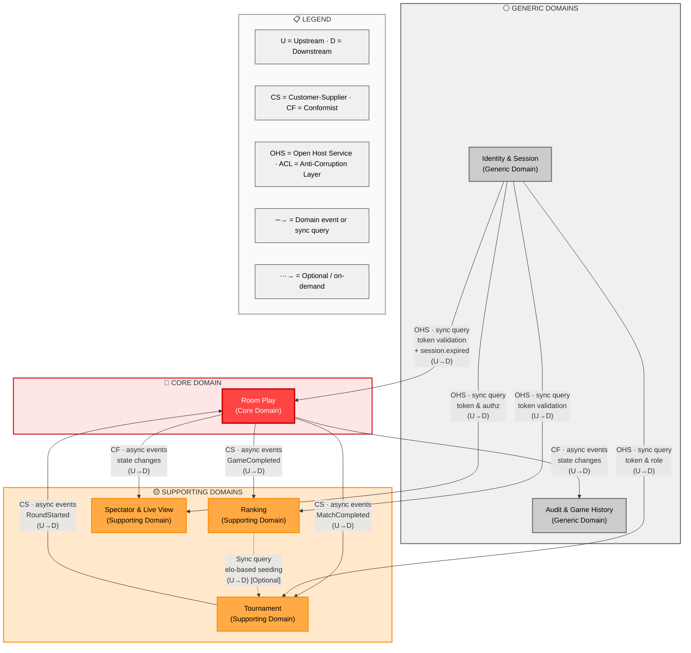

# UnoArena — Domain Design Document

> Proyecto académico · Arquitectura de Microservicios · ITBA 2026
> Derived from: `REQUIREMENTS.md`

---

## 1. Event Storming

### 1.1 Room Play Flow (temporal, left to right)

A room hosts a **match** (best-of-three series of individual **games**). The flow below describes one game within a match; the match-level lifecycle wraps around it.

```
Actor           Command              Event                        Aggregate      Policy / Hotspot
─────           ───────              ─────                        ─────────      ────────────────

Player      →   CreateRoom        →  RoomCreated                  Room
Player      →   JoinRoom          →  PlayerJoined                 Room
System      →   StartMatch        →  MatchStarted                 Room           Policy: match starts when min players reached and host triggers start
System      →   StartGame         →  GameStarted                  Room           Policy: first game of the best-of-three begins; or next game after previous game ends if no player has 2 wins yet
                                     DeckShuffled                 Room
                                     CardsDealt                   Room
                                     InitialCardRevealed          Room
                                     TurnStarted                  Room

Player      →   PlayCard          →  CardPlayed                   Room           Policy: card must match discard pile top by color or face, or be wild
                                     DirectionReversed            Room           Policy: reverse card flips turn direction
                                     TurnSkipped                  Room           Policy: skip card advances past next player
                                     DrawPenaltyApplied           Room           Policy: draw-two / wild-draw-four forces next player to draw

Player      →   DrawCard          →  CardDrawn                    Room
                                     TurnAdvanced                 Room

Player      →   CallUno           →  UnoCallMade                  Room           Policy: must be called when player plays second-to-last card, before next turn
Player      →   ChallengeUnoCall  →  UnoCallChallenged            Room           Policy: challenge valid only within 5-second window or before next turn starts (whichever is first)
                                     ChallengePenaltyApplied      Room           Policy: missed Uno → target draws 2; false challenge → challenger draws 2

System      →   ExpireTurn        →  TurnTimedOut                 Room           Policy: if turn timer expires, system skips the player's turn (pass)
System      →   DetectDisconnect  →  PlayerDisconnected           Room           Policy: 60-second grace timer starts; disconnected player's turns are skipped (passed), no bot substitution
Player      →   Reconnect         →  PlayerReconnected            Room           Policy: player resumes with original hand; delta replay from last known sequence number
System      →   ExpireGraceTimer  →  PlayerForfeited              Room           Policy: casual room → player removed, game continues with remaining players; tournament room → counted as match loss, player eliminated

System      →   DetectGameWinner  →  GameCompleted                Room           Policy: player plays last card → game winner determined; card-point totals recorded for all players
                                     GameResultPublished          Room           Policy: published to Ranking (casual only) and Audit

[If no player has won 2 games yet → System triggers StartGame for next game in the series]

System      →   DetectMatchWinner →  MatchCompleted               Room           Policy: first player to win 2 games wins the match; final placement order (1st through last) determined
                                     MatchResultPublished         Room           Policy: result published to Tournament (if tournament room), Ranking (placement order), Audit
```

**Hotspots (puntos de conflicto):**

- 🔴 **Concurrent play**: Two players submit actions simultaneously → Resolved via sequence numbers and optimistic rejection. The authoritative game state has a single writer; the second action arrives with a stale sequence number and is rejected.
- 🔴 **Challenge window boundary**: The 5-second Uno challenge window closes either after 5 seconds OR when the next player begins their turn, whichever comes first. Server-authoritative timestamps determine validity.
- 🔴 **Disconnection vs. turn timeout**: Independent timers. The 60-second grace timer governs participant status; turn timeouts continue and result in skipped turns (passes). No extra time is granted.
- 🔴 **Stale actions**: A player sends an action against an outdated state version → Rejected; client must reconcile from the live state stream.
- 🔴 **Best-of-three edge cases**: What if a player disconnects between games within a match? → The grace timer applies across the match, not per game. Forfeit mid-match = match loss.
- 🔴 **False challenge penalty**: A player challenges an Uno call that was correctly made → The challenger draws 2 cards, not the target.

### 1.2 Tournament Flow (temporal, left to right)

```
Actor                   Command                Event                           Aggregate       Policy / Hotspot
─────                   ───────                ─────                           ─────────       ────────────────

TournamentOperator  →   CreateTournament    →  TournamentCreated               Tournament
TournamentOperator  →   OpenRegistration    →  RegistrationOpened              Tournament
Player              →   RegisterForTournament → PlayerRegistered               Tournament
TournamentOperator  →   CloseRegistration   →  RegistrationClosed              Tournament

System              →   GenerateBrackets    →  BracketsGenerated               Tournament      Policy: players grouped into rooms of up to 10
                                               RoundStarted                    Tournament
                                               MatchesScheduled                Tournament      Policy: rooms requested for all matches in the round

[Room Play context runs best-of-three matches and emits MatchCompleted events]

System              →   IngestMatchResult   →  MatchResultRecorded             Tournament      Policy: idempotent on {matchId, gameNumber, sequenceNumber}
System              →   DetermineAdvancers  →  Top3Advanced                    Tournament      Policy: top 3 players by match wins advance; tie-breaker 1: lower cumulative card-point total; tie-breaker 2: earliest final-game completion time
                                               PlayersEliminated               Tournament      Policy: non-top-3 players marked as eliminated
                                               RoundCompleted                  Tournament      Policy: round completes when all rooms in it have reported results

[If more than 10 players remain → System triggers GenerateBrackets for next round]

System              →   CreateFinalRoom     →  FinalRoomCreated                Tournament      Policy: when ≤10 players remain, a single final room is created
System              →   DetectChampion      →  TournamentCompleted             Tournament      Policy: final room match winner is the tournament champion; full standings determined
                                               FinalStandingsPublished         Tournament

TournamentOperator  →   CancelTournament    →  TournamentCancelled             Tournament      Policy: all further advancement stops immediately; in-flight results discarded
```

**Hotspots (puntos de conflicto):**

- 🔴 **Mass simultaneous completion**: Up to 100,000 rooms in a round complete near-simultaneously → Must handle burst ingestion without corrupting bracket state.
- 🔴 **Crash mid-advancement**: System fails between recording a result and advancing players → Saga pattern with idempotent steps; replay on recovery.
- 🔴 **Cancelled tournament + in-flight results**: A result arrives after cancellation → Discarded; no advancement or ranking updates triggered.
- 🔴 **Top-3 tie-breaking edge cases**: All players in a room have the same match wins and card-point totals → Earliest final-game completion time breaks the tie. If still tied (simultaneous completion), arbitrary but deterministic ordering (e.g., by playerId) is applied.
- 🔴 **Odd player counts**: When remaining players don't divide evenly into rooms of 10 → Rooms are filled as evenly as possible (e.g., 23 players → rooms of 8, 8, 7).

### 1.3 Ranking Flow

```
Actor       Command                 Event                      Aggregate        Policy
─────       ───────                 ─────                      ─────────        ──────

System  →   ProcessCasualGameResult → EloUpdated               PlayerRanking    Policy: Elo updated once per completed casual game (not per match, not per tournament)
                                     RatingHistoryAppended     PlayerRanking    Policy: delta calculated from final placement order (1st through last) within the room
                                                                                Policy: idempotent on {gameId, sequenceNumber}
                                                                                Policy: abandoned games (forfeit by all remaining players) do NOT affect Elo
```

**Note:** Tournament play uses a separate **tournament-placement rating** that is updated based on tournament standings, not the global Elo system.

---

## 2. Strategic Design

### 2.1 Subdomain Classification

| Subdomain | Type | Justification |
|---|---|---|
| Game Engine (Room Play) | **Core** | Primary differentiator: turn logic, concurrency control, RNG fairness, penalty resolution, card validation, best-of-three match management. Highest business complexity. |
| Tournament Management | **Core** | Bracket orchestration at massive scale, multi-round progression with top-3 advancement, saga-based coordination. Critical to the platform's competitive value. |
| Ranking & Elo | **Supporting** | Important for competitive engagement but follows well-known Elo algorithms. Casual Elo and tournament placement are distinct but straightforward. |
| Spectator & Live View | **Supporting** | Enables the viewing experience. Primarily a projection and delivery concern with moderate domain logic (view filtering, eligibility, privacy enforcement). |
| Audit & Game History | **Generic** | Standard append-only logging and replay. No unique business logic — any event-sourced audit system would behave similarly. |
| Identity & Session | **Generic** | Authentication, single-active-session, token lifecycle, RBAC — commodity. Built in-house per project constraints but the domain logic is industry-standard. |

### 2.2 Bounded Contexts

| Bounded Context | Responsibilities | Owns |
|---|---|---|
| **Room Play** | Room lifecycle, game lifecycle (within best-of-three), turn progression, card validation, Uno call/challenge (5s window), penalty resolution, disconnection/reconnection (60s grace, skip turns), match completion, placement order | Authoritative game and match state per room |
| **Tournament** | Tournament lifecycle, registration, bracket generation, round management, result ingestion, top-3 advancement with tie-breakers, final room creation at ≤10 players | Bracket structure and advancement state |
| **Ranking** | Casual Elo calculation (per game, from placement order), tournament-placement rating, rating history, leaderboard generation | Player ratings and rating history |
| **Spectator & Live View** | Player-specific and spectator projections, live state delivery, state reconciliation on reconnect, privacy enforcement (no private hands in spectator view) | Projected views (read-only, not authoritative) |
| **Audit & Game History** | Immutable game log, replay support, dispute support, retention management | Append-only game and match history |
| **Identity & Session** | Authentication, single-active-session enforcement, session lifecycle, token management, role-based authorization, rate limiting | User accounts, credentials, sessions |

### 2.3 Context Map



**Relationships:**

- **Room Play → Tournament** (Customer-Supplier, Published Language): Room Play publishes `MatchCompleted` events (with placement order). Tournament consumes them to determine top-3 advancers. Tournament applies an Anti-Corruption Layer to validate and deduplicate incoming results.
- **Room Play → Ranking** (Customer-Supplier, Published Language): Room Play publishes `GameCompleted` events (casual games only, with placement order). Ranking consumes them for Elo updates. Ranking applies its own eligibility rules (ACL): only casual games, not abandoned.
- **Room Play → Spectator & Live View** (Conformist, Published Language): Room Play publishes state change events. Spectator context builds read-only projections following Room Play's event schema. Privacy enforcement: spectator projections never include private hands.
- **Room Play → Audit & Game History** (Conformist, Published Language): Room Play publishes all state changes. Audit appends them immutably.
- **Tournament → Room Play** (Customer-Supplier): When a new round starts, Tournament publishes `RoundStarted` events requesting room creation for all matches in the round. When ≤10 players remain, it requests creation of the final room.
- **Ranking → Tournament** (Optional sync query): Tournament may query Ranking for current Elo ratings when seeding rules require elo-based placement.
- **Identity & Session → Room Play, Spectator, Tournament, Ranking** (Open Host Service): Identity provides authentication and authorization via a published API. Enforces single-active-session. Each consuming context applies its own Anti-Corruption Layer for token validation and role interpretation. Session expiry events flow to Room Play to trigger disconnection handling.

### 2.4 Ubiquitous Language

| Term | Definition | Owning Context(s) |
|---|---|---|
| **Game** | A single Uno game within a room: cards are dealt, turns are played, and one player wins by emptying their hand. Multiple games form a match. | Room Play |
| **Match** | A **best-of-three series** of games within a room. The match winner is the first player to win 2 games. In Tournament context: the match also determines placement order for advancement. | Room Play, Tournament |
| **Room** | A game instance with 2–10 players that hosts a match (best-of-three). Has a lifecycle: waiting → in_progress → completed/cancelled. | Room Play |
| **Round** | One elimination tier in a tournament. All rooms in a round play their matches concurrently. All must complete before the next round begins. | Tournament |
| **Tournament** | A multi-round elimination competition. Rounds continue until ≤10 players remain, then a final room determines the champion. Lifecycle: planned → open_for_registration → in_progress → completed/cancelled. | Tournament |
| **Placement Order** | The ranking of all players in a room at match end (1st through last), based on game wins. Used by Ranking for Elo calculation and by Tournament for top-3 advancement. | Room Play, Tournament, Ranking |
| **Player** | In Room Play: an active participant holding a hand of cards. In Ranking: a rated entity with Elo and tournament-placement history. In Identity: a role claim on a user account. | Room Play, Ranking, Identity |
| **Turn** | The active period during which a single player may submit actions. Bounded by a timeout deadline. | Room Play |
| **Card** | An immutable game piece defined by Color and Face. Two cards with identical attributes are interchangeable (structural equality). | Room Play |
| **Hand** | The set of Cards held by a Player. Private to the owning player; never exposed to spectators or other players. | Room Play, Spectator |
| **Discard Pile** | The shared stack of played cards. Only the top card is relevant for determining play legality. | Room Play |
| **Draw Pile** | The shared deck from which players draw. Managed server-side with deterministic RNG. | Room Play |
| **Sequence Number** | A monotonically increasing integer representing the authoritative version of a room's game state. Used for optimistic concurrency control. | Room Play |
| **Challenge Window** | A 5-second window (or until the next turn starts, whichever is first) during which players may challenge a missed Uno call. Server-authoritative timestamps. | Room Play |
| **Grace Timer** | The 60-second reconnection window after a player disconnects. Disconnected player's turns are skipped (passed). On expiry: casual room → player removed; tournament room → match loss. | Room Play |
| **Game Result** | An immutable snapshot of a completed game: winner, card-point totals per player. Published to Ranking (casual only) and Audit. | Room Play, Ranking |
| **Match Result** | An immutable snapshot of a completed match (best-of-three): match winner, game-win counts, placement order, cumulative card-point totals. Published to Tournament and Audit. | Room Play, Tournament |
| **Bracket** | The elimination structure of a tournament. Players are grouped into rooms per round; top 3 per room advance. | Tournament |
| **Player Slot** | A position within a bracket assigned to a specific player, including their seeding rank. | Tournament |
| **Elo Rating** | A numeric skill rating for casual play, updated once per completed casual game based on placement order. | Ranking |
| **Tournament-Placement Rating** | A separate rating reflecting tournament performance, distinct from global Elo. | Ranking |
| **Spectator** | A user observing a room without participating. Receives only the public projection. Must be authorized for private rooms/tournaments. | Spectator, Identity |
| **Player View** | The projection sent to an active player: includes their private hand plus all public state. | Spectator |
| **Spectator View** | The projection sent to spectators: public state only (player names, card counts, discard pile, turn info). No hands, no RNG seed. | Spectator |
| **State Patch** | An incremental delta representing a single state transition, delivered to connected clients. | Spectator |
| **Game Log** | The immutable, append-only record of every state change in a game. Supports replay and dispute resolution. | Audit |
| **Game Log Entry** | A single record: event type, timestamp, player ID, sequence number, RNG seed reference. | Audit |
| **Session** | An authenticated user session. Only one active session per player. Expiry during an active game triggers the 60-second grace timer flow. | Identity, Room Play |
| **Idempotency Key** | A composite value used by all event consumers to deduplicate events and prevent double-processing. | Cross-cutting |
| **Correlation ID** | A unique identifier attached to every domain event, traceable from the originating action through to the audit log. | Cross-cutting |

---

## 3. Tactical Design

### 3.1 Room Play Context

**Aggregate Root: `Room`** — The transactional consistency boundary for all gameplay within a match (best-of-three series). All state mutations (play card, draw, call Uno, apply penalty, advance game within match) are coordinated through the Room aggregate.

**Entities:**

- `Player` — Identified by `PlayerId`. Holds the player's hand, connection status, Uno-call flag, and game-win count within the current match. Mutable throughout the match lifecycle. Identity persists across reconnections and across games within a match.
- `Turn` — Identified by `TurnNumber`. Represents the current active turn with its owner, start timestamp, and timeout deadline. A new Turn entity is created on each turn advancement.
- `GameInstance` — Identified by `GameNumber` (1, 2, or 3 within the match). Tracks the state of an individual game within the best-of-three: deck, discard pile, hands, turn order, direction, and game winner.

**Value Objects:**

- `Card` — Immutable. Defined by `Color` (red, yellow, green, blue, wild) and `Face` (0–9, skip, reverse, draw-two, wild, wild-draw-four). Structural equality.
- `GameResult` — Immutable snapshot at game completion: game winner, card-point totals per player.
- `MatchResult` — Immutable snapshot at match completion: match winner, game-win counts per player, placement order (1st through last), cumulative card-point totals.
- `PlacementOrder` — Ordered list of players ranked by game wins within the match. Used for Elo and tournament advancement.
- `SequenceNumber` — Monotonically increasing integer. Self-validating: must be non-negative and strictly greater than the previous value.
- `RngSeed` — Immutable seed for the deterministic RNG of a game. Stored per game for replay and audit.
- `ChallengeWindow` — Immutable time interval: opens on second-to-last card play, closes at min(5 seconds later, next turn start). Server-authoritative.
- `GraceTimer` — Duration value (60 seconds). During the window, disconnected player's turns are skipped.
- `RoomConfiguration` — Immutable after creation. Encapsulates player count (2–10), room type (casual/tournament), turn timeout duration.

**Invariants:**

- A card can only be played if it is in the active player's hand and matches the discard pile top by color or face (or is wild).
- Only the current turn owner may submit play/draw actions (DR-8).
- The sequence number on every command must match the room's current sequence number; otherwise rejected.
- A room in `completed` or `cancelled` state rejects all gameplay commands (DR-2).
- The Uno challenge is only valid within the 5-second `ChallengeWindow`.
- A match consists of at most 3 games. The match ends when a player wins 2 games.
- A disconnected player's turns are skipped (passed), not played by a bot.
- Forfeit behavior depends on room type: casual → removed, game continues; tournament → match loss.

**Domain Events:**

| Event | Payload (conceptual) | Consumers |
|---|---|---|
| `RoomCreated` | roomId, configuration, hostPlayerId | Spectator (projection setup) |
| `PlayerJoined` | roomId, playerId | Spectator (update participant list) |
| `MatchStarted` | roomId, playerIds | Spectator, Audit |
| `GameStarted` | roomId, gameNumber, rngSeed | Spectator, Audit |
| `CardPlayed` | roomId, playerId, card, resultingState, sequenceNumber | Spectator (live update), Audit (game log) |
| `CardDrawn` | roomId, playerId, sequenceNumber | Spectator, Audit |
| `UnoCallMade` | roomId, playerId, sequenceNumber | Spectator, Audit |
| `UnoCallChallenged` | roomId, challengerId, targetPlayerId, penaltyApplied, penaltyTarget | Spectator, Audit |
| `TurnAdvanced` | roomId, nextPlayerId, turnNumber | Spectator |
| `TurnTimedOut` | roomId, playerId, actionApplied (skip/pass) | Spectator, Audit |
| `PlayerDisconnected` | roomId, playerId, graceTimerDeadline | Spectator |
| `PlayerReconnected` | roomId, playerId | Spectator |
| `PlayerForfeited` | roomId, playerId, reason, roomType (casual/tournament) | Tournament (if tournament), Spectator, Audit |
| `GameCompleted` | roomId, gameNumber, gameResult (winner, cardPointTotals) | Ranking (casual rooms only, for Elo), Audit |
| `MatchCompleted` | roomId, matchResult (winner, gameWins, placementOrder, cumulativeCardPoints) | Tournament (top-3 advancement), Audit, Spectator |

**Repository (domain interface):**

- `findRoomById(roomId)` → Room
- `findActiveRoomsByPlayer(playerId)` → List\<Room\>

### 3.2 Tournament Context

**Aggregate Root: `Tournament`** — Consistency boundary for tournament lifecycle: registration, bracket generation, round advancement (top-3), final room creation, cancellation.

**Entities:**

- `Round` — Identified by `RoundNumber`. Contains a set of room-matches. Tracks completion status. A new round is created when the previous one completes and more than 10 players remain.
- `RoomMatch` — Identified by `RoomMatchId`. Links a set of `PlayerSlot` entries to a room. Tracks match status (pending, in_progress, completed), resulting placement order, and the top-3 advancers.

**Value Objects:**

- `PlayerSlot` — Immutable reference to a player within a bracket position. Contains `PlayerId` and seeding rank.
- `RoundNumber` — Non-negative sequential integer identifying a tournament round.
- `TournamentConfiguration` — Immutable after creation. Encapsulates max-players-per-room (up to 10), seeding strategy, and tournament type.
- `SeedingStrategy` — Strategy identifier (random, elo-based). Determines initial bracket placement.
- `TieBreaker` — The fixed tie-breaking algorithm: (1) lower cumulative card-point total, (2) earliest final-game completion time, (3) deterministic playerId ordering as last resort.
- `AdvancementResult` — Immutable. The top-3 players and eliminated players from a single room-match.

**Invariants:**

- A tournament in `cancelled` state discards all incoming match results (DR-11).
- Only the top 3 players per room advance; tie-breaking follows the fixed algorithm.
- Rounds continue until ≤10 players remain, then a final room is created (DR-14).
- A room-match cannot advance players unless it has a `completed` result with a valid placement order.
- Advancement decisions are always made against authoritative write-side state, never eventually consistent read models.

**Domain Events:**

| Event | Payload (conceptual) | Consumers |
|---|---|---|
| `TournamentCreated` | tournamentId, configuration | Spectator |
| `RegistrationOpened` | tournamentId | Spectator |
| `PlayerRegistered` | tournamentId, playerId | Spectator |
| `BracketsGenerated` | tournamentId, roundNumber, roomAssignments | Spectator |
| `RoundStarted` | tournamentId, roundNumber, roomMatchIds | Room Play (room creation), Spectator |
| `Top3Advanced` | tournamentId, roomMatchId, advancingPlayerIds | Spectator |
| `PlayersEliminated` | tournamentId, roomMatchId, eliminatedPlayerIds | Spectator |
| `RoundCompleted` | tournamentId, roundNumber | Spectator |
| `FinalRoomCreated` | tournamentId, playerIds | Room Play, Spectator |
| `TournamentCompleted` | tournamentId, champion, finalStandings | Spectator, Ranking |
| `TournamentCancelled` | tournamentId, reason | Spectator, Ranking (stops processing) |

**Repository (domain interface):**

- `findTournamentById(tournamentId)` → Tournament
- `findActiveTournamentsByPlayer(playerId)` → List\<Tournament\>
- `findPendingRoomMatchesByRound(tournamentId, roundNumber)` → List\<RoomMatch\>

### 3.3 Ranking Context

**Aggregate Root: `PlayerRanking`** — Consistency boundary for a single player's rating history. Separate tracks for casual Elo and tournament-placement rating.

**Value Objects:**

- `EloRating` — Immutable. Rating value at a point in time with timestamp. Applies to casual games only.
- `TournamentPlacementRating` — Immutable. Separate rating reflecting tournament performance.
- `EloUpdate` — Immutable. Contains gameId, previous rating, new rating, delta, and placement position within the room.
- `IdempotencyKey` — Composite value `{gameId, sequenceNumber}` for deduplication.
- `RankingEligibility` — Whether a game result qualifies for Elo update: must be a completed casual game (not tournament, not abandoned).

**Invariants:**

- An `EloUpdate` with a duplicate `IdempotencyKey` is silently discarded.
- Only casual, non-abandoned game results affect global Elo.
- Elo is updated per game, not per match or per tournament.
- Elo delta is calculated from the player's position in the placement order (1st through last).
- Rating history is append-only; past entries are never modified.
- Tournament-placement rating is updated separately from global Elo.

**Domain Events:**

| Event | Payload (conceptual) | Consumers |
|---|---|---|
| `EloUpdated` | playerId, gameId, previousRating, newRating, delta, placement | Spectator (leaderboard refresh) |

**Repository (domain interface):**

- `findPlayerRanking(playerId)` → PlayerRanking
- `findTopRankings(limit)` → List\<PlayerRanking\>
- `findTopTournamentRankings(limit)` → List\<PlayerRanking\>

### 3.4 Spectator & Live View Context

This context is projection-oriented; it does not own authoritative game state.

**Aggregate Root: `RoomProjection`** — Projected view of a room's current state, rebuilt from events emitted by Room Play.

**Value Objects:**

- `PlayerView` — Player-specific projection: includes private hand, card count, Uno-call status, game-win count.
- `SpectatorView` — Public-only projection: player names, card counts per player, discard pile top card, current turn, direction, draw pile size, Uno-call statuses, game-win counts. No hands, no RNG seed.
- `StatePatch` — Incremental delta describing a single state transition.
- `SubscriberRole` — Enum: `player` or `spectator`. Determines which projection stream the client receives.

**Invariants:**

- A `SpectatorView` must never contain any player's hand contents or the RNG seed.
- A `PlayerView` for player X must never contain player Y's hand contents.
- The projection boundary is enforced at construction time, not at delivery time.

### 3.5 Audit & Game History Context

**Aggregate Root: `GameLog`** — Identified by `GameId` (unique per individual game within a match). Complete, immutable record. Only supports append operations.

**Value Objects:**

- `GameLogEntry` — Immutable. Contains event type, server timestamp, playerId, sequenceNumber, and RNG seed reference.
- `RetentionPolicy` — Defines retention duration based on match type (competitive vs. casual).

**Invariants:**

- Entries are append-only; no mutation or deletion within the retention period.
- Every entry must have a strictly monotonic sequence number within its GameLog.

**Repository (domain interface):**

- `findGameLog(gameId)` → GameLog
- `findGameLogsByMatch(roomId)` → List\<GameLog\>
- `findGameLogEntriesByPlayer(gameId, playerId)` → List\<GameLogEntry\>

### 3.6 Identity & Session Context

**Aggregate Root: `UserAccount`** — Consistency boundary for identity, credentials, and role assignments.

**Entities:**

- `Session` — Identified by `SessionId`. Represents the single active session for a user. Tracks creation time, last activity, and associated refresh token. Mutable (refreshable, revocable).

**Value Objects:**

- `RoleClaim` — Enum set: `player`, `spectator`, `tournament_operator`, `admin`.
- `Credentials` — Immutable. Encapsulates hashed password and salt. Never exposed outside the aggregate.

**Invariants:**

- Only one active session per player at any time. A new login invalidates the previous session (DR-15).
- A revoked session/token cannot be used for further requests.
- Role claims in a token must reflect the user's current roles at issuance time.
- Session expiry during an active game triggers the 60-second grace timer flow in Room Play.

---

## 4. Domain Event Flow Narratives

### 4.1 Room Creation to Completion (end-to-end)

1. **Player** sends `CreateRoom` → Room aggregate validates configuration → emits `RoomCreated` (async → Spectator sets up projection).
2. **Players** send `JoinRoom` → Room validates capacity (2–10) → emits `PlayerJoined` per player (async → Spectator updates participant list).
3. **Host** sends `StartMatch` → Room validates min players reached → emits `MatchStarted` (async → Spectator, Audit).
4. **System** starts game 1 → Room initializes deck with RNG seed, deals cards, reveals initial card → emits `GameStarted`, `DeckShuffled`, `CardsDealt`, `InitialCardRevealed`, `TurnStarted` (async → Spectator builds initial projection, Audit logs all).
5. **Players take turns** (synchronous decision point): each `PlayCard`/`DrawCard`/`CallUno`/`ChallengeUnoCall` command is validated synchronously against authoritative state with sequence number check → emits corresponding events (async → Spectator delivers patches, Audit appends).
6. A player empties their hand → Room detects game winner, calculates card-point totals → emits `GameCompleted` (async → Ranking processes Elo for casual rooms, Audit records).
7. If no player has 2 game wins yet → System starts next game (return to step 4, game 2 or 3).
8. A player reaches 2 game wins → Room calculates placement order → emits `MatchCompleted` (async → Tournament ingests result for advancement if tournament room, Audit records final result, Spectator shows end state).
9. Room transitions to `completed` and rejects all further commands.

### 4.2 Tournament Round Advancement (end-to-end)

1. **TournamentOperator** creates and opens tournament → `TournamentCreated`, `RegistrationOpened` (async → Spectator).
2. **Players** register → `PlayerRegistered` per player.
3. **Operator** closes registration → `RegistrationClosed`.
4. **System** generates brackets → groups players into rooms of up to 10 → emits `BracketsGenerated`, `RoundStarted`, `MatchesScheduled` (async → Room Play creates rooms).
5. Room Play runs best-of-three matches in parallel across all rooms.
6. As each room completes, Room Play emits `MatchCompleted` with placement order (asynchronous propagation to Tournament).
7. **Tournament** consumes `MatchCompleted` (synchronous decision point): validates idempotency key, checks tournament isn't cancelled, determines top-3 advancers using tie-breaking rules → emits `Top3Advanced`, `PlayersEliminated`, and (when all rooms report) `RoundCompleted`.
8. If >10 players remain → return to step 4 for next round.
9. If ≤10 players remain → emits `FinalRoomCreated` (async → Room Play creates the final room).
10. Final room completes → `MatchCompleted` → Tournament determines champion → `TournamentCompleted` with final standings.

### 4.3 Elo/Ranking Update After Game Completion

1. Room Play emits `GameCompleted` with gameId, room type (casual/tournament), game winner, card-point totals, and placement context.
2. **Ranking** consumes the event (asynchronous propagation).
3. Ranking checks eligibility (synchronous decision point): Is it a casual game? Is it abandoned (forfeit by all)? → If not eligible, event is discarded.
4. Ranking checks idempotency key `{gameId, sequenceNumber}` → If duplicate, silently discarded.
5. Ranking calculates Elo delta based on placement order (1st through last) within the room using weighted formula.
6. Ranking applies update to `PlayerRanking` aggregate for each player → emits `EloUpdated` per player (async → Spectator refreshes leaderboard).

---

## 5. Edge Cases and Failure-Path Analysis

### 5.1 Concurrent Conflicting Actions

**Scenario:** Two players submit `PlayCard` at the same time for the same game state.

**Expected behavior:** The room aggregate has a single authoritative writer. Both commands carry a sequence number. The first to be processed succeeds and increments the sequence number. The second arrives with a now-stale sequence number and is rejected. The rejected player's client reconciles by consuming the live state stream to obtain the current authoritative state.

**Emitted events:** `CardPlayed` (for the accepted action only). No event for the rejected action — the rejection is communicated synchronously to the submitting client.

### 5.2 Disconnection and Late Rejoin

**Scenario A — Reconnection within 60 seconds:**

The system detects the disconnect → emits `PlayerDisconnected` with grace timer deadline. During the window, if it becomes the disconnected player's turn, the turn is skipped (treated as a pass) → emits `TurnAdvanced`. When the player reconnects within 60s → emits `PlayerReconnected`. The player receives a delta replay from their last known sequence number and resumes with their original hand.

**Scenario B — Grace timer expires:**

After 60 seconds with no reconnection, the system issues an automatic forfeit → emits `PlayerForfeited`. In a casual room, the player is removed and the game continues with remaining players. In a tournament room, the player receives a match loss and is eliminated from the tournament → the match ends and emits `MatchCompleted` with the remaining player as winner.

**Scenario C — Late rejoin (after grace timer expiry):**

The player attempts to reconnect after the 60-second window has closed. The room aggregate has already processed the forfeit. The reconnection is rejected — the player is informed that they have been forfeited. No events emitted.

### 5.3 Stale Commands and Replayed Commands

**Stale command:** A client sends a `PlayCard` with sequence number N, but the room is already at sequence number N+1 (another action was processed). The command is rejected synchronously. No domain events emitted.

**Replayed command (duplicate):** A client retransmits the same command due to network issues. If the sequence number matches (the first attempt wasn't processed), it succeeds normally. If the first attempt was already processed, the sequence number is stale and it is rejected. This makes the system naturally idempotent at the command level.

**Replayed events at consumers:** All downstream consumers (Tournament, Ranking, Audit) enforce idempotency via composite keys. Duplicate events are silently discarded.

### 5.4 Partial Failures Between Contexts

**Scenario A — Room completes but Tournament doesn't receive the event:**

Room Play emits `MatchCompleted`. If the event bus loses the event or Tournament crashes before processing it, the event remains in the event bus for redelivery (at-least-once delivery assumption). Tournament's idempotency key prevents double-processing on retry.

**Scenario B — Tournament crashes mid-advancement (after recording result, before advancing players):**

The saga pattern ensures each step is idempotent. On restart, Tournament re-reads unprocessed events and replays the saga. Since result recording is idempotent, the duplicate is discarded, and advancement proceeds.

**Scenario C — Ranking fails to process a game result:**

The event remains available for reprocessing. Ranking's idempotency key ensures no double Elo updates. The leaderboard may show stale data temporarily (eventual consistency is acceptable for rankings).

**Scenario D — Audit service is down:**

Game events accumulate in the event bus. When Audit recovers, it processes the backlog. Game integrity is preserved because the immutable log is append-only and order is maintained by sequence numbers.

### 5.5 Security and Abuse Scenarios

**Session takeover:** An attacker obtains a valid token. Single-active-session enforcement (DR-15) means a legitimate new login invalidates the stolen session. The Identity context emits `session.expired`, which triggers the disconnection grace timer in any active room. Rate limiting on login attempts mitigates brute-force attacks.

**Action flooding / spam:** Multi-layer rate limits (per IP, per user, per room action) with adaptive throttling prevent a player from flooding a room with rapid commands. Commands exceeding the rate limit are rejected before reaching the room aggregate.

**Manipulated game state:** All game state authority resides server-side. Client inputs are treated as untrusted. The sequence number mechanism prevents replay attacks. The deterministic RNG with stored seeds makes any manipulation detectable via audit replay.

**Tournament result manipulation:** All events carry correlation IDs traceable to origin. Idempotency keys prevent duplicate result injection. Tournament advancement only processes events from verified Room Play origins (anti-corruption layer).

### 5.6 Spectator Privacy Violations

**Scenario A — Player attempts to read another player's hand via spectator channel:**

The projection boundary is enforced at construction time, not at delivery time. The `SpectatorView` value object is built without hand contents — the data physically does not exist in the spectator projection. Even if a player subscribes to the spectator channel instead of their player channel, they cannot access other players' hands because the data was never included.

**Scenario B — Player subscribes to another player's player channel:**

The subscriber role is determined by the authenticated session and the Identity context. A player can only receive the `PlayerView` for their own playerId. Attempting to subscribe to another player's channel is rejected at the authorization layer before any data is delivered.

**Scenario C — Spectator attempts to submit gameplay commands:**

The room aggregate checks the actor's role on every command. Commands from spectators are rejected — spectators have read-only access (DR-5). No events emitted.

---

## 6. Consistency and Recovery Strategy

### 6.1 Idempotency and Deduplication

All cross-context event consumers enforce idempotency using composite keys:
- **Tournament:** `{roomMatchId, sequenceNumber}` — prevents double-counting match results.
- **Ranking:** `{gameId, sequenceNumber}` — prevents duplicate Elo updates.
- **Audit:** `{gameId, sequenceNumber}` — prevents duplicate log entries (though append-only stores are naturally tolerant of replay if entries are identical).

At the command level, sequence numbers make Room Play naturally idempotent: the same command against the same state version produces the same result; against a newer version, it is rejected.

### 6.2 Saga Pattern for Tournament Advancement

Tournament round advancement is a multi-step process: result ingestion → top-3 determination → player advancement → (if applicable) next round room creation. Each step:
- Is **idempotent**: repeating it with the same input produces no additional side effects.
- Is **individually persistent**: progress is checkpointed after each step.
- Has **compensation where needed**: if room creation fails for a next-round room, the system retries creation without re-doing advancement.

### 6.3 Invariant Violation Prevention

| Invariant | Prevention Mechanism |
|---|---|
| Single authoritative game state (NFR-C1) | One writer per room; all mutations go through the Room aggregate root |
| Ordered action processing (NFR-C2) | Sequence numbers; stale actions rejected |
| No corrupt state from concurrency (NFR-C3) | Optimistic concurrency control; single-writer guarantee |
| Tournament correctness under burst (NFR-C4) | Idempotent saga steps; write-side advancement only |
| Ranking consistency (NFR-C5) | Idempotency keys; eligibility checks before update |
| No spectator data leakage (DR-5) | Privacy enforced at projection construction, not delivery |
| Single active session (DR-15) | New login invalidates old session at Identity aggregate level |

### 6.4 Recovery from Context-Level Failures

- **Room Play failure:** The room's last committed state (event log) is the recovery point. On restart, the room aggregate is reconstructed from the event log. In-flight commands that were not acknowledged are retried by clients (who will detect stale sequence numbers if the command was already processed).
- **Tournament failure:** Idempotent saga replay from the event bus. Unprocessed `MatchCompleted` events are redelivered and processed.
- **Ranking failure:** Events accumulate in the bus; on recovery, Ranking processes the backlog. Idempotency keys prevent double updates.
- **Spectator failure:** Projections are rebuilt from Room Play events. Clients reconnect and request a snapshot, then resume receiving patches.
- **Audit failure:** Events accumulate; on recovery, the backlog is appended. Sequence numbers ensure correct ordering.

---

## 7. Architecture Decisions (Flow, not Technology)

### 7.1 Separation of command processing and state distribution

Player actions are submitted synchronously and validated against the authoritative game state. Accepted state changes are then propagated asynchronously to all connected clients. This separation exists because game logic needs to serialize concurrent actions (one authoritative writer per room), while state distribution is a fan-out problem that scales independently.

### 7.2 Optimistic concurrency via sequence numbers

Every client command carries a sequence number representing the client's known state version. If the number is stale, the command is rejected and the client must reconcile by consuming the live state stream. This avoids locking while guaranteeing that concurrent or stale actions never corrupt authoritative state.

### 7.3 Saga-based tournament orchestration

Tournament advancement follows a saga pattern: result ingestion → top-3 determination → next-round room creation. Each step is idempotent and replayable. This is necessary because tournament rounds involve thousands of independently completing matches, and synchronous orchestration would create brittle coupling and temporal dependencies.

### 7.4 Eventual consistency between Game and Tournament contexts

When a match completes, the Room Play context publishes the result as a domain event. The Tournament context consumes it asynchronously. Bracket state is eventually consistent with match outcomes — acceptable because bracket advancement is not time-critical. The authoritative advancement decision is always made against the write-side state, never the read-optimized projection.

### 7.5 Asynchronous Elo calculation (CQRS)

Ranking updates are computed asynchronously from game result events, producing a read-optimized leaderboard. This decouples the latency-sensitive gameplay path from ranking recalculation. Rankings are a read model — they don't need to be consistent at the moment a game ends, only eventually correct.

### 7.6 Immutable audit log for game integrity

Every state change in a room is appended to an immutable log before being broadcast. The log includes deterministic RNG seeds, enabling full game replay. This provides the traceability required for dispute resolution and fraud investigation without adding latency to the gameplay path.

### 7.7 Projection-based live views with role separation

The live view system builds separate projections for players (who see their own hand) and spectators (who see only public state). Privacy is enforced at the projection level — a spectator stream physically cannot contain private data because it was never included. This is safer than filtering at delivery time.

### 7.8 Disconnection and reconnection as domain-level concerns

Disconnection is handled within the game domain, not as an infrastructure concern. The room aggregate manages the 60-second grace timer and skips the disconnected player's turns (no bot substitution). On reconnection, the player receives a delta from their last known sequence number. Forfeit behavior differs by room type (casual vs. tournament).

---

## 8. Open Questions and Assumptions

### 8.1 Assumptions

| # | Assumption | Rationale |
|---|---|---|
| A1 | **At-least-once delivery** for domain events between contexts. | Idempotency keys at all consumers make this safe. Exactly-once would simplify consumers but is harder to guarantee. |
| A2 | **Event ordering is guaranteed within a single room's event stream** but not globally across rooms. | Per-room ordering is sufficient for game integrity. Global ordering is unnecessary and would be a bottleneck. |
| A3 | **Server clock is authoritative** for all time-sensitive decisions (challenge window, grace timer, turn timeout). | Client clocks are untrusted. All timing decisions use server-side timestamps. |
| A4 | **Card-point totals** follow standard Uno scoring: number cards = face value, action cards = 20 points, wild cards = 50 points. | Used for tie-breaking in tournaments. The specific scoring rule needs confirmation with stakeholders. |
| A5 | **Deterministic RNG** means the same seed always produces the same shuffle/draw sequence. | Required for audit replay. The specific PRNG algorithm is an implementation detail. |
| A6 | **Rate limit thresholds** (per IP, per user, per action) are configurable and will be tuned based on load testing. | Specific values are an operational concern, not a domain design decision. |

### 8.2 Open Questions

| # | Question | Impact |
|---|---|---|
| Q1 | **What is the turn timeout duration?** The assignment specifies 60s for disconnection but not for turn timeout. | Affects gameplay pacing. Needs to be defined — possibly configurable per room type. |
| Q2 | **Can a player voluntarily leave a casual room mid-match?** Or is the only exit path disconnection/forfeit? | Affects room lifecycle and whether we need a `LeaveRoom` command distinct from disconnection. |
| Q3 | **What happens when a casual room drops below 2 players due to forfeits?** Does the remaining player win by default? | Affects game-end detection logic and whether an abandoned game (below minimum players) counts for Elo. |
| Q4 | **How is tournament-placement rating calculated?** The assignment mentions it exists separately from Elo but doesn't define the formula. | Affects the Ranking context model. May be based on tournament finishing position. |
| Q5 | **Is there a maximum tournament size beyond 1M, or is 1M the hard cap?** | Affects capacity planning assumptions, though not domain design directly. |
| Q6 | **Can spectators observe tournament bracket state, or only individual room games?** | Affects whether the Spectator context needs a `TournamentProjection` in addition to `RoomProjection`. |
| Q7 | **What happens if the initial card revealed from the draw pile is a wild or action card?** Standard Uno rules vary on this. | Affects the `InitialCardRevealed` event handling in the Room aggregate. |
| Q8 | **Connection-semantics assumption:** We assume clients connect via a long-lived channel for receiving state updates and a request-response channel for submitting commands. The specific protocols are out of scope for this iteration. | Protocol design is deferred per Section 3 of the assignment instructions. |
